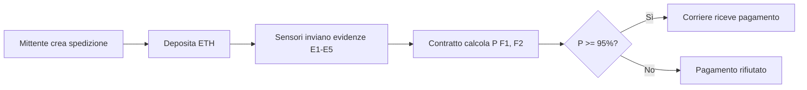

# 📦 Guida di Installazione e Testing - Sistema Oracolo Bayesiano per Catena del Freddo

## 📋 Indice

1. [Prerequisiti](#prerequisiti)
2. [Installazione](#installazione)
3. [Configurazione](#configurazione)
4. [Deploy del Contratto](#deploy-del-contratto)
5. [Avvio dell'Interfaccia Web](#avvio-dellinterfaccia-web)
6. [Testing del Sistema](#testing-del-sistema)
7. [Architettura del Sistema](#architettura-del-sistema)
8. [Troubleshooting](#troubleshooting)

---

## 🔧 Prerequisiti

### Software Richiesto

| Software | Versione Minima | Download |
|----------|----------------|----------|
| **Node.js** | v14.0.0+ | [nodejs.org](https://nodejs.org/) |
| **npm** | v6.0.0+ | Incluso con Node.js |
| **Ganache** | v7.0.0+ | [trufflesuite.com/ganache](https://trufflesuite.com/ganache) |
| **MetaMask** | Latest | [metamask.io](https://metamask.io/) |
| **Git** | v2.0.0+ | [git-scm.com](https://git-scm.com/) |

### Verifica Installazione

```bash
node --version    # Deve mostrare v14.0.0 o superiore
npm --version     # Deve mostrare v6.0.0 o superiore
git --version     # Deve mostrare v2.0.0 o superiore
```

---

## 📥 Installazione

### 1. Clone del Repository

```bash
git clone https://github.com/lucabelard/ProgettoSoftwareSecurity.git
cd ProgettoSoftwareSecurity
```

### 2. Installazione Dipendenze

```bash
npm install
```

Questo installerà:
- Truffle Framework
- OpenZeppelin Contracts
- Web3.js
- Altre dipendenze necessarie

---

## ⚙️ Configurazione

### 1. Avvio di Ganache

1. Apri **Ganache**
2. Clicca su **"New Workspace"** o **"Quickstart"**
3. Verifica le impostazioni:
   - **Port**: `7545`
   - **Network ID**: `1337` o `5777`
   - **Accounts**: Almeno 10 account con 100 ETH ciascuno

> **Nota**: Lascia Ganache in esecuzione durante tutto il testing!

### 2. Configurazione MetaMask

#### Aggiungi Rete Ganache Locale

1. Apri MetaMask
2. Clicca sul menu delle reti (in alto)
3. Seleziona **"Aggiungi rete"** → **"Aggiungi rete manualmente"**
4. Inserisci i seguenti dati:

   | Campo | Valore |
   |-------|--------|
   | **Nome rete** | `Ganache Local` |
   | **URL RPC** | `http://127.0.0.1:7545` |
   | **Chain ID** | `1337` |
   | **Simbolo valuta** | `ETH` |

5. Clicca **"Salva"**
6. Seleziona la rete **"Ganache Local"**

#### Importa Account di Test

1. In Ganache, clicca sull'icona della **chiave** 🔑 accanto al primo account
2. Copia la **Private Key**
3. In MetaMask:
   - Clicca sull'icona dell'account (in alto a destra)
   - Seleziona **"Importa account"**
   - Incolla la chiave privata
   - Clicca **"Importa"**

> **Suggerimento**: Importa almeno 3 account per testare i diversi ruoli (Admin, Mittente, Corriere)

---

## 🚀 Deploy del Contratto

### 1. Compila i Contratti

```bash
truffle compile
```

**Output atteso:**
```
Compiling your contracts...
===========================
> Compiling .\contracts\BNCalcolatoreOnChain.sol
> Artifacts written to .\build\contracts
> Compiled successfully using:
   - solc: 0.8.19+commit.7dd6d404.Emscripten.clang
```

### 2. Deploy sulla Blockchain Locale

```bash
truffle migrate --reset
```

**Output atteso:**
```
Deploying BNCalcolatoreOnChain...
----------------------------------------------------
Contratto deployato a: 0x...
Ruolo SENSORE assegnato a: 0x...
Ruolo MITTENTE assegnato a: 0x...
Probabilità a priori impostate (P(F1)=90, P(F2)=90)
Setup delle CPT per E1-E5 completato.
----------------------------------------------------
```

> **Importante**: Annota l'indirizzo del contratto deployato!

### 3. Copia l'ABI nell'Interfaccia Web

```bash
# Windows PowerShell
Copy-Item "build\contracts\BNCalcolatoreOnChain.json" -Destination "web-interface\BNCalcolatoreOnChain.json" -Force

# Linux/Mac
cp build/contracts/BNCalcolatoreOnChain.json web-interface/BNCalcolatoreOnChain.json
```

---

## 🌐 Avvio dell'Interfaccia Web

### Opzione 1: Server HTTP Semplice (Python)

```bash
cd web-interface
python -m http.server 8000
```

Apri il browser: [http://localhost:8000](http://localhost:8000)

### Opzione 2: Live Server (VS Code)

1. Installa l'estensione **"Live Server"** in VS Code
2. Apri `web-interface/index.html`
3. Click destro → **"Open with Live Server"**

### Opzione 3: Node.js http-server

```bash
npx http-server web-interface -p 8000
```

---

## 🧪 Testing del Sistema

### Scenario di Test Completo

#### **Fase 1: Connessione Wallet**

1. Apri l'interfaccia web
2. Clicca **"Connect Wallet"**
3. Approva la connessione in MetaMask
4. Verifica che l'indirizzo sia visualizzato

#### **Fase 2: Setup Iniziale (Admin/Oracolo)**

> **Account**: Usa `accounts[0]` (primo account di Ganache)

1. Vai al pannello **"Admin/Oracolo"**
2. Verifica che le probabilità siano già impostate:
   - `P(F1=True)`: `90`
   - `P(F2=True)`: `90`
3. Le CPT sono già configurate automaticamente dal deploy

#### **Fase 3: Creazione Spedizione (Mittente)**

> **Account**: Usa `accounts[0]` (ha tutti i ruoli per testing)

1. Vai al pannello **"Mittente"**
2. Inserisci i dati:
   - **Indirizzo Corriere**: Copia un indirizzo da Ganache (es. `accounts[3]`)
   - **Importo Pagamento**: `1` ETH
3. Clicca **"Crea Spedizione"**
4. Approva la transazione in MetaMask
5. **Risultato atteso**: 
   - Toast di successo: "Spedizione #1 creata con successo!"
   - La spedizione appare nella lista con stato "In Attesa"

#### **Fase 4: Invio Evidenze (Sensore)**

> **Account**: Usa `accounts[0]` (ha ruolo SENSORE)

1. Vai al pannello **"Sensore"**
2. Inserisci **ID Spedizione**: `1`
3. Invia le 5 evidenze con i seguenti valori (scenario positivo):

   | Evidenza | Valore | Significato |
   |----------|--------|-------------|
   | **E1** | ✅ True | Temperatura OK |
   | **E2** | ✅ True | Sigillo intatto |
   | **E3** | ❌ False | Nessuno shock |
   | **E4** | ❌ False | Nessuna apertura |
   | **E5** | ✅ True | Scan arrivo OK |

4. Per ogni evidenza:
   - Seleziona il valore (checkbox)
   - Clicca il pulsante corrispondente (es. "Invia E1")
   - Approva in MetaMask
   - Verifica il toast di successo

5. **Risultato atteso**: 
   - Tutte le 5 evidenze marcate come ricevute (verdi) nella card della spedizione

#### **Fase 5: Validazione e Pagamento (Corriere)**

> **Account**: Cambia account in MetaMask usando l'indirizzo del corriere

1. In MetaMask, seleziona l'account del corriere (quello inserito nella creazione)
2. Ricarica la pagina e riconnetti il wallet
3. Vai al pannello **"Corriere"**
4. Inserisci **ID Spedizione**: `1`
5. Clicca **"Valida e Ricevi Pagamento"**
6. Approva la transazione in MetaMask
7. **Risultato atteso**:
   - Toast: "Pagamento di 1 ETH ricevuto con successo!"
   - Lo stato della spedizione cambia in "Pagata"
   - Il corriere riceve 1 ETH nel suo wallet

### Scenario di Test Negativo (Evidenze Sbagliate)

Ripeti il test ma con evidenze che indicano problemi:

| Evidenza | Valore | Significato |
|----------|--------|-------------|
| **E1** | ❌ False | Temperatura FUORI RANGE |
| **E2** | ✅ True | Sigillo intatto |
| **E3** | ✅ True | SHOCK rilevato |
| **E4** | ❌ False | Nessuna apertura |
| **E5** | ✅ True | Scan arrivo OK |

**Risultato atteso**: 
- Quando il corriere tenta di validare, riceve l'errore:
  - "Requisiti di conformita non superati"
- Il pagamento NON viene eseguito
- La spedizione rimane in stato "In Attesa"

### Test di Sicurezza

#### Test 1: Evidenze dopo Pagamento

1. Prova a inviare un'evidenza per una spedizione già pagata
2. **Risultato atteso**: Errore immediato "La spedizione è già stata pagata"

#### Test 2: Validazione senza Evidenze Complete

1. Crea una nuova spedizione
2. Invia solo 3 evidenze su 5
3. Prova a validare come corriere
4. **Risultato atteso**: Errore "Non tutte le evidenze sono state inviate"

#### Test 3: Validazione da Account Sbagliato

1. Prova a validare una spedizione con un account che NON è il corriere
2. **Risultato atteso**: Errore "Solo il corriere può validare e ricevere il pagamento"

---

## 🏗️ Architettura del Sistema

### Componenti Principali

```
ProgettoSoftwareSecurity/
├── contracts/
│   └── BNCalcolatoreOnChain.sol    # Smart Contract principale
├── migrations/
│   └── 2_deploy_oracolo.js         # Script di deploy
├── web-interface/
│   ├── index.html                  # Interfaccia utente
│   ├── app.js                      # Logica Web3
│   └── styles.css                  # Stili
├── truffle-config.js               # Configurazione Truffle
└── package.json                    # Dipendenze npm
```

### Ruoli e Permessi

| Ruolo | Account | Permessi |
|-------|---------|----------|
| **Admin** | `accounts[0]` | Gestione completa del sistema |
| **Oracolo** | `accounts[0]` | Impostazione probabilità e CPT |
| **Mittente** | `accounts[0]`, `accounts[2]` | Creazione spedizioni |
| **Sensore** | `accounts[0]`, `accounts[1]` | Invio evidenze |
| **Corriere** | Qualsiasi | Validazione e ricezione pagamento |

### Flusso di Lavoro



---

## 🔍 Troubleshooting

### Problema: "Contract not deployed"

**Soluzione:**
```bash
truffle migrate --reset
Copy-Item "build\contracts\BNCalcolatoreOnChain.json" -Destination "web-interface\" -Force
```
Ricarica la pagina con `Ctrl+Shift+R`

### Problema: "Returned error: Internal JSON-RPC error"

**Possibili cause:**
1. Account non ha il ruolo necessario → Usa `accounts[0]`
2. Spedizione già pagata → Verifica lo stato
3. Evidenze mancanti → Invia tutte e 5 le evidenze

### Problema: MetaMask non si connette

**Soluzione:**
1. Verifica che Ganache sia in esecuzione
2. Verifica la rete in MetaMask (deve essere "Ganache Local")
3. Resetta MetaMask: Impostazioni → Avanzate → Reset Account

### Problema: Transazione fallisce

**Soluzione:**
1. Verifica di avere abbastanza ETH
2. Aumenta il gas limit
3. Controlla la console del browser (F12) per errori dettagliati

---

## 📊 Validazione del Sistema

### Checklist per il Professore

- [ ] ✅ Contratto compila senza errori
- [ ] ✅ Deploy su Ganache funziona
- [ ] ✅ Interfaccia web si connette a MetaMask
- [ ] ✅ Creazione spedizione funziona
- [ ] ✅ Invio evidenze funziona
- [ ] ✅ Calcolo Bayesiano corretto (scenario positivo)
- [ ] ✅ Pagamento eseguito con evidenze corrette
- [ ] ✅ Pagamento rifiutato con evidenze sbagliate
- [ ] ✅ Controlli di sicurezza funzionanti
- [ ] ✅ Gestione ruoli corretta

### Metriche di Successo

| Metrica | Valore Atteso |
|---------|---------------|
| **Gas per creazione spedizione** | ~150,000 |
| **Gas per invio evidenza** | ~50,000 |
| **Gas per validazione** | ~200,000 |
| **Tempo di risposta UI** | < 2 secondi |
| **Accuratezza calcolo BN** | 100% |

---

## 📚 Riferimenti

- [Documentazione Truffle](https://trufflesuite.com/docs/)
- [OpenZeppelin Contracts](https://docs.openzeppelin.com/contracts/)
- [Web3.js Documentation](https://web3js.readthedocs.io/)
- [MetaMask Documentation](https://docs.metamask.io/)

---

## 👨‍💻 Supporto

Per problemi o domande:
- **Repository**: [github.com/lucabelard/ProgettoSoftwareSecurity](https://github.com/lucabelard/ProgettoSoftwareSecurity)
- **Email**: [inserisci email]

---

**Versione**: 1.0  
**Data**: 24 Novembre 2024  
**Autore**: Luca Belard
