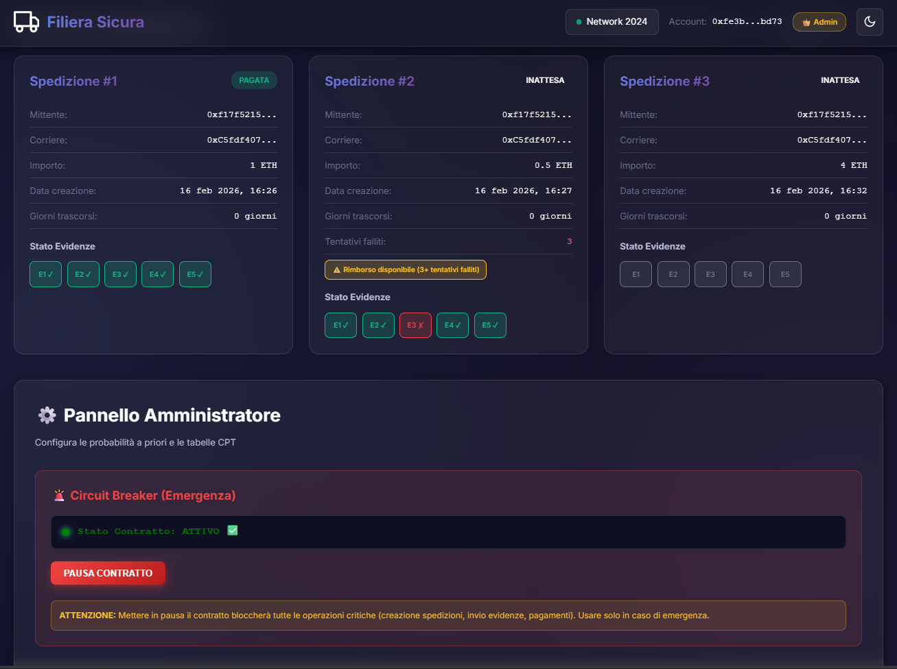
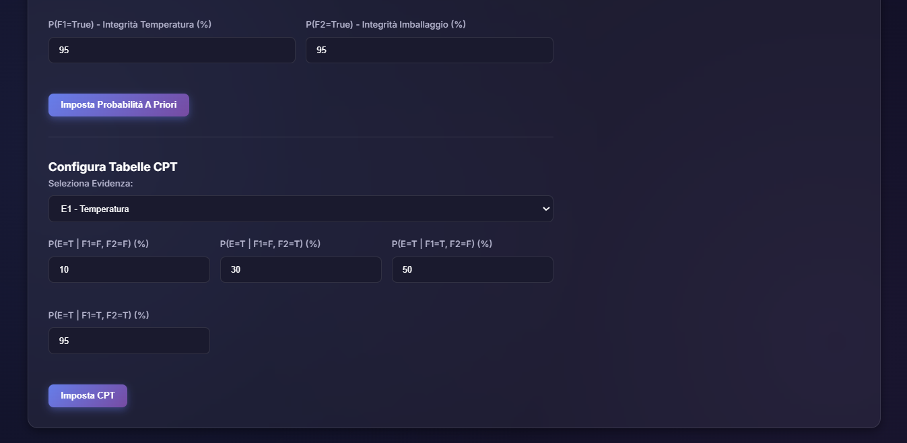
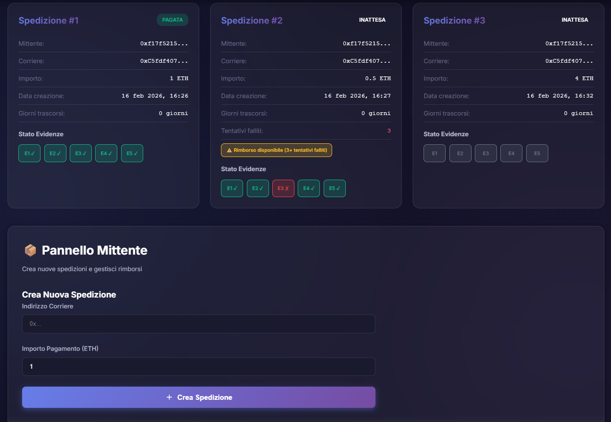
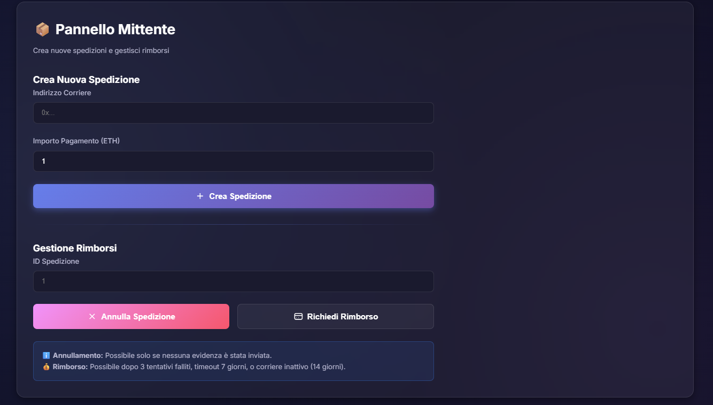
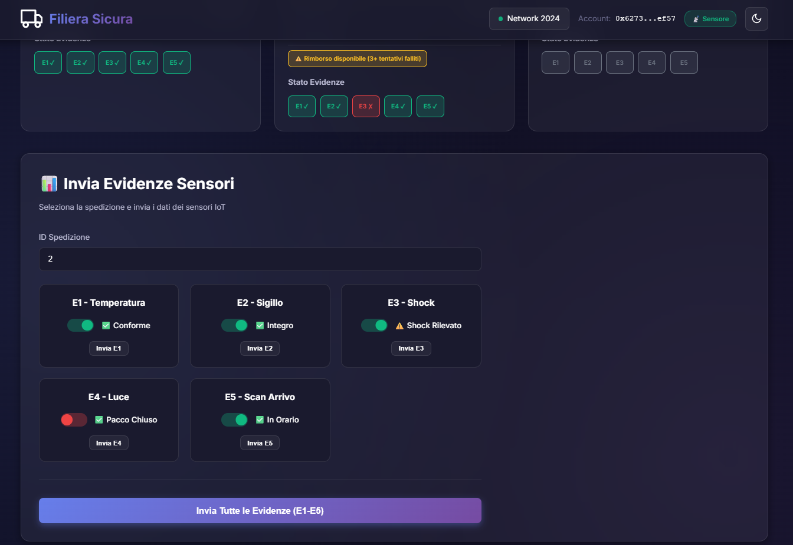
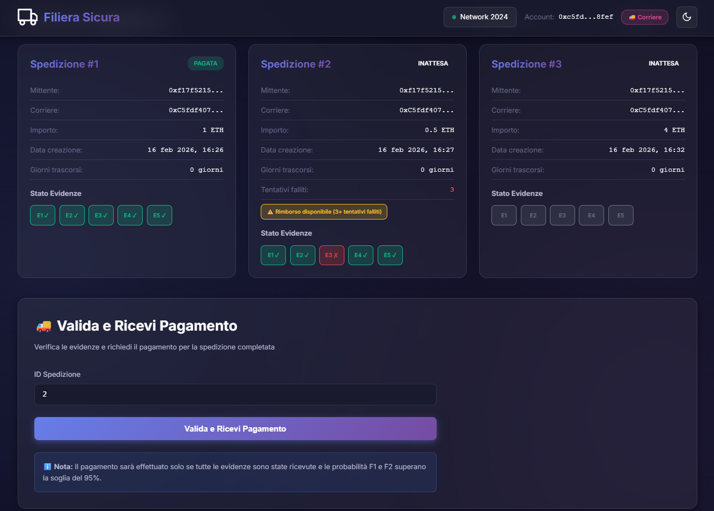

# 📦 Progetto Software Security - Catena del freddo


Il presente documento fornisce una guida tecnica completa per l'installazione, la configurazione e l'utilizzo del sistema di tracciamento basato su blockchain. L'architettura comprende una rete Blockchain Besu privata, Smart Contracts dedicati e un'interfaccia web per l'interazione utente.

---

## 🛠️ Prerequisiti di sistema

Prima di iniziare, assicurati di avere installato i seguenti componenti. Le versioni sono **vincolanti** per il corretto funzionamento.

| Componente | Versione richiesta | Note |
| :--- | :--- | :--- |
| **Node.js** | `v18.x` o superiore | gestore runtime JS |
| **Java JDK** | `v17` (consigliato) o `v11` | necessario per eseguire Besu |
| **Hyperledger Besu** | `v25.11.0` | **CRITICO:** versioni differenti possono causare errori di consenso |
| **MetaMask** | Estensione browser | wallet per interagire con la blockchain |

## 📥 0. Download del Progetto
Inizia clonando il repository e posizionandoti nella cartella di lavoro:

```bash
git clone https://github.com/lucabelard/ProgettoSoftwareSecurity.git
cd ProgettoSoftwareSecurity
```

## 📦 1. Installazione automatica dipendenze (JS)
Il file `package.json` è configurato per gestire le dipendenze JavaScript (Truffle, Web3, OpenZeppelin).

1.  Apri il terminale nella cartella del progetto.
2.  Esegui il comando:
    ```bash
    npm install
    ```
    *Questo installerà `truffle` localmente, garantendo che tutti utilizzino la stessa versione.*

---

## ⚙️ 2. Installazione system-level (manuale)

Le dipendenze di sistema (Besu, Java) devono essere configurate manualmente o tramite script, poiché variano in base al sistema operativo.

### 🪟 Windows Setup

#### 1. Java JDK
Assicurati di avere Java installato. Verifica con `java -version`. Se mancante, scarica e installa [Java JDK 17](https://www.oracle.com/java/technologies/downloads/#java17).

#### 2. Hyperledger Besu (v25.11.0)
Besu non si installa tramite `npm`. Va scaricato e aggiunto al PATH.

1.  **Download:** scarica lo zip di Besu v25.11.0 direttamente [qui](https://github.com/hyperledger/besu/releases/download/25.11.0/besu-25.11.0.zip).
2.  **Estrazione:** estrai il contenuto in una cartella stabile, ad esempio `C:\Besu`.
3.  **Configurazione PATH (Variabili d'ambiente):**
    *   Premi `Win + R`, digita `sysdm.cpl` e premi Invio.
    *   Vai su **Avanzate** > **Variabili d'ambiente**.
    *   Nella sezione **Variabili di sistema**, trova la variabile `Path` e clicca **Modifica**.
    *   Clicca **Nuovo** e incolla il percorso alla cartella `bin` di Besu (es. `C:\Besu\besu-25.11.0\bin`).
    *   Conferma tutto con OK.
4.  **Verifica:** apri un **nuovo** terminale (CMD o PowerShell) e digita:
    ```bash
    besu --version
    ```
    *Dovresti vedere l'output confermare la versione 25.11.0.*

### 🍎 Mac / Linux Setup

#### 1. Java JDK
Verifica con `java -version`. Se necessario, installalo tramite Homebrew:
```bash
brew install openjdk@17
```
Al termine, segui le istruzioni di Homebrew per aggiungere Java al PATH. Tipicamente:
```bash
echo 'export PATH="/opt/homebrew/opt/openjdk@17/bin:$PATH"' >> ~/.zshrc
source ~/.zshrc
```
Verifica con `java -version`.

#### 2. Hyperledger Besu (v25.11.0)
Besu non si installa tramite `npm`. Va scaricato manualmente per garantire la versione corretta.

**Metodo manuale (consigliato per v25.11.0):**
1.  **Download:** scarica il pacchetto `.tar.gz` direttamente [qui](https://github.com/hyperledger/besu/releases/download/25.11.0/besu-25.11.0.tar.gz).
2.  **Estrazione:** estrai l'archivio e spostalo in una cartella stabile:
    ```bash
    tar -xvf besu-25.11.0.tar.gz
    sudo mv besu-25.11.0 /usr/local/besu
    ```
3.  **Configurazione PATH:** aggiungi Besu al PATH nel tuo `~/.zshrc` (o `~/.bash_profile` per Bash):
    ```bash
    echo 'export PATH=$PATH:/usr/local/besu/bin' >> ~/.zshrc
    source ~/.zshrc
    ```
4.  **Verifica:** apri un **nuovo** terminale e digita:
    ```bash
    besu --version
    ```
    *Dovresti vedere l'output confermare la versione 25.11.0.*

---

## 🚀 3. Inizializzazione del sistema

Scegli il tuo sistema operativo e segui le istruzioni dedicate.

### 🪟 Ambiente Windows

> [!TIP]
> **Consigliato:** eseguire la pulizia preventiva per evitare conflitti o errori di _Genesis Mismatch_.

**1. Pulizia preventiva**
```cmd
.\besu-config\scripts\windows\clean-data.bat
```

> [!WARNING]
> Dopo la pulizia, resetta la cache di MetaMask: **Impostazioni > Avanzate > Cancella dati attività** (Clear activity tab data). Questo evita errori di nonce quando la blockchain riparte da zero.

**2. Avvio rete Blockchain**
Questo script avvia il cluster di 4 nodi e il proxy di failover in finestre separate.
```cmd
.\besu-config\scripts\windows\start-all-nodes-failover.bat
```
*   **Verifica:** assicurati che le istanze dei nodi siano attive e che lo stato del proxy indichi *Monitoring active...*.

### 🍎 Ambiente Mac / Linux

**1. Pulizia preventiva & permessi**
Rimuove dati di vecchie sessioni e processi appesi.
```bash
chmod +x ./besu-config/scripts/mac/*.sh
./besu-config/scripts/mac/clean-data.sh
```

> [!WARNING]
> Dopo la pulizia, resetta la cache di MetaMask: **Impostazioni > Avanzate > Cancella dati attività** (Clear activity tab data). Questo evita errori di nonce quando la blockchain riparte da zero.

**2. Avvio rete Blockchain**
Avvia il cluster e il proxy aprendo automaticamente nuovi terminali per ogni nodo.
```bash
./besu-config/scripts/mac/start-all.sh
```
*   **Verifica:** assicurati che le finestre del terminale (Node 1–4 + proxy) siano aperte e producano log.

---

## 🦊 Configurazione MetaMask

Per configurare la rete su MetaMask:
1.  Clicca sulle **3 linee** in alto a destra (o sull'icona del profilo).
2.  Vai su **Impostazioni > Reti** (Settings > Networks).
3.  Clicca su **"Aggiungi una rete"** (Add a network) > **"Aggiungi una rete manualmente"**.
4.  Inserisci i seguenti parametri:

| Parametro | Valore |
| :--- | :--- |
| **Nome Rete** | Localhost 8545 |
| **RPC URL** | `http://127.0.0.1:8545` |
| **Chain ID** | `2024` |
| **Simbolo Valuta** | `ETH` |

> [!NOTE]
> Vai su *Settings > General* e attiva **"Show native token as main balance"** per visualizzare correttamente i fondi.

### 👤 Importazione account di test
Per interagire con il sistema, importa i seguenti account pre-finanziati nel tuo wallet MetaMask.

**Procedura di Importazione:**
1.  Clicca sull'icona circolare dell'account (generalmente in alto a sinistra).
2.  Seleziona **"Add wallet"** (o "Add account").
3.  Clicca su **"Importa account"**.
4.  Incolla la **Chiave Privata** (dalla tabella sottostante) e conferma.
5.  Ripeti per tutti gli account che vuoi usare.

| Ruolo | Indirizzo Pubblico | Chiave Privata (SOLO PER TESTNET) |
| :--- | :--- | :--- |
| **👑 Admin** | `0xfe3b557e8fb62b89f4916b721be55ceb828dbd73` | `0x8f2a55949038a9610f50fb23b5883af3b4ecb3c3bb792cbcefbd1542c692be63` |
| **🌡️ Sensore** | `0x627306090abaB3A6e1400e9345bC60c78a8BEf57` | `0xc87509a1c067bbde78beb793e6fa76530b6382a4c0241e5e4a9ec0a0f44dc0d3` |
| **📤 Mittente** | `0xf17f52151EbEF6C7334FAD080c5704D77216b732` | `0xae6ae8e5ccbfb04590405997ee2d52d2b330726137b875053c36d94e974d162f` |
| **🚚 Corriere** | `0xC5fdf4076b8F3A5357c5E395ab970B5B54098Fef` | `0x0dbbe8e4ae425a6d2687f1a7e3ba17bc98c673636790f1b8ad91193c05875ef1` |

### ⚠️ Risoluzione problemi macOS (Chain ID)
Il sistema utilizza di default **Chain ID 2024**. Su alcuni ambienti macOS, MetaMask potrebbe rifiutare questo valore durante la configurazione della rete con un errore di connessione.

> [!NOTE]
> Non è garantito che si verifichi questo problema — prova prima con Chain ID **2024**. Procedi con i passi seguenti solo se MetaMask non accetta la configurazione.

**Soluzione alternativa (solo se necessario):**
1.  In MetaMask, configura la rete con **Chain ID: 2025** anziché 2024 (il file genesis Mac supporta già questo valore).
2.  Riavvia la rete Besu con `./besu-config/scripts/mac/start-all.sh`.

## 📜 4. Deploy degli Smart Contracts

Dopo l'inizializzazione della rete, procedi con il deploy e la configurazione dei contratti.

### 🪟 Windows
```cmd
# Compilazione (obbligatoria al primo avvio)
npx truffle compile

# Deploy e Configurazione Completa
node deploy-complete.js
```

### 🍎 Mac / Linux
```bash
# Compilazione
npx truffle compile

# Deploy tramite Truffle (include migrazione e setup)
npx truffle migrate --network besu
```

> [!IMPORTANT]
> Entrambi i metodi eseguono il deploy, l'assegnazione dei ruoli e la configurazione delle probabilità iniziali.

---

## 💻 5. Interfaccia web

Avvia l'interfaccia utente per interagire con il sistema distribuito.

*   **🪟 Windows:** eseguire `.\besu-config\scripts\windows\avvia-sito.bat`
*   **🍎 Mac/Linux:** eseguire `./besu-config/scripts/mac/avvia-sito.sh`

🔗 **URL di Accesso:** `http://127.0.0.1:8080`

> [!NOTE]
> Al primo avvio, `npx` potrebbe chiederti di installare il pacchetto `http-server`. Conferma premendo `y`.


<br>
<sub>**1) Pagina principale del sistema**</sub>


<br>

<br>
<sub>**2) Vista Admin**</sub>


<br>

<br>
<sub>**3) Vista Mittente**</sub>


<br>
<sub>**4) Vista Sensori**</sub>


<br>
<sub>**5) Vista Corriere**</sub>

---

## 🔄 6. Flussi operativi

### 👑 Pannello amministratore
Accesso tramite account **Admin**.
*   **Monitoraggio spedizioni:** visualizzazione in tempo reale dello stato.
*   **Circuit Breaker:** arresto di emergenza. *Ricaricare la pagina dopo la modifica.*
*   **Parametri:** regolazione soglie e affidabilità.

### ✅ Flusso standard (consegna riuscita)
1.  **Mittente:** crea la spedizione (indirizzo corriere + importo ETH).
2.  **Sensore:** inserisce ID spedizione e invia conferma/evidenze (senza anomalie).
3.  **Corriere:** esegue la validazione consegna → fondi rilasciati.

### 🚫 Annullamento anticipato (pre-evidenze)
1.  **Mittente:** crea la spedizione.
2.  **Azione:** se il sensore non ha ancora inviato evidenze, il mittente può annullare la spedizione.
3.  **Risultato:** i fondi vengono restituiti immediatamente al mittente.
    *   *Vincolo:* se le evidenze sono già state registrate, l'annullamento è disabilitato.

### ❌ Scenari di rimborso (failure modes)
Il rimborso automatico viene attivato in tre casi specifici per garantire la protezione dei fondi:

**1. Merce non conforme (danneggiata)**
1.  **Sensore:** rileva anomalie (es. temperatura fuori soglia) e invia le evidenze.
2.  **Corriere:** tenta la validazione, che fallisce.
3.  **Azione:** dopo **3 tentativi falliti** di validazione, il contratto sblocca il rimborso.
4.  **Mittente:** recupera i fondi.

**2. Timeout evidenze (7 giorni)**
*   Se il sensore non invia alcuna evidenza entro **7 giorni** dalla creazione, la spedizione è considerata *persa* o *non partita*.
*   Il mittente può richiedere il rimborso immediato.

**3. Inattività corriere (14 giorni)**
*   Se le evidenze sono valide ma il corriere non finalizza la consegna entro **14 giorni**, il sistema presume inadempienza.
*   Il mittente può forzare il rimborso per recuperare i fondi bloccati.

---

## ❓ Risoluzione problemi

| Problema | Soluzione |
| :--- | :--- |
| **Genesis Mismatch** | inconsistenza dati blockchain.<br>**Win:** `.\besu-config\scripts\windows\clean-data.bat`<br>**Mac:** `./besu-config/scripts/mac/clean-data.sh`<br>Riavviare la rete dopo la pulizia. |
| **Errore Nonce** | si verifica dopo il riavvio della rete.<br>**Azione:** MetaMask → Impostazioni > Avanzate > Cancella dati attività. |
| **Contratti assenti** | assicurati di aver eseguito il deploy (`node deploy-complete.js` o `truffle migrate`) **dopo** l'avvio della rete. |
| **Interfaccia non aggiornata** | se lo stato del contratto non cambia (es. dopo blocca/sblocca), **aggiorna la pagina** del browser. |

---
