# 🎯 Analisi i* - Sistema Oracolo Bayesiano per Catena del Freddo

## Indice

1. [SD/SR Supply Chain SENZA Sistema](#1-sdsr-supply-chain-senza-sistema)
2. [SD/SR Supply Chain CON Sistema](#2-sdsr-supply-chain-con-sistema)
3. [SD/SR Sistema e Attaccanti](#3-sdsr-sistema-e-attaccanti)
4. [Alberi di Attacco](#4-alberi-di-attacco)

---

## 1. SD/SR Supply Chain SENZA Sistema

### Strategic Dependency (SD) Model - Scenario AS-IS

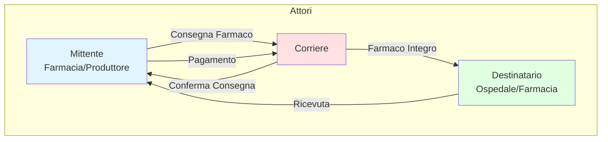

### Strategic Rationale (SR) Model - Mittente AS-IS

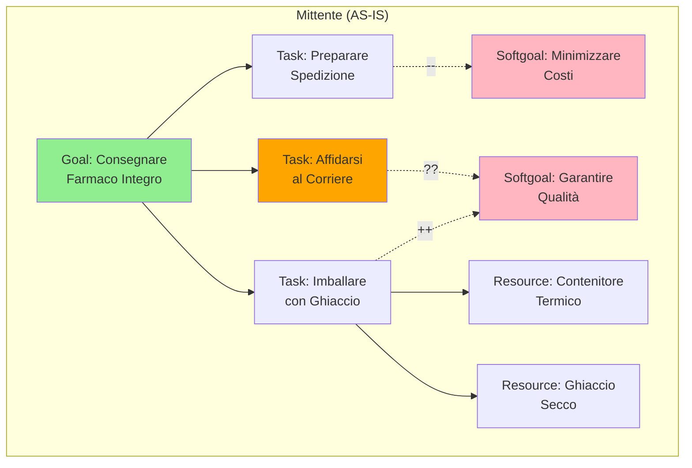

**Problemi Identificati (AS-IS):**
- ❌ **Nessuna Garanzia**: Il mittente non ha garanzie sulla conformità
- ❌ **Fiducia Cieca**: Deve fidarsi completamente del corriere
- ❌ **Nessun Monitoraggio**: Non può verificare temperatura/integrità
- ❌ **Dispute**: Difficile risolvere controversie su responsabilità
- ❌ **Pagamento Anticipato**: Rischio di pagare per servizio non conforme

### Strategic Rationale (SR) Model - Corriere AS-IS

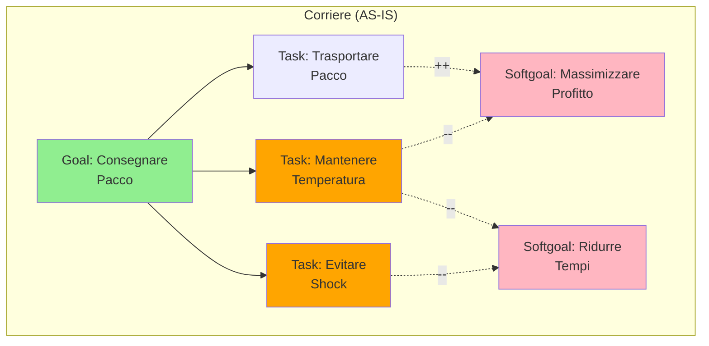

**Problemi Identificati (AS-IS):**
- ⚠️ **Conflitto di Interessi**: Profitto vs. Qualità
- ⚠️ **Incentivi Sbagliati**: Pagato anche se non conforme
- ⚠️ **Nessuna Responsabilità**: Difficile provare negligenza
- ⚠️ **Moral Hazard**: Può risparmiare su qualità senza conseguenze

---

## 2. SD/SR Supply Chain CON Sistema

### Strategic Dependency (SD) Model - Scenario TO-BE

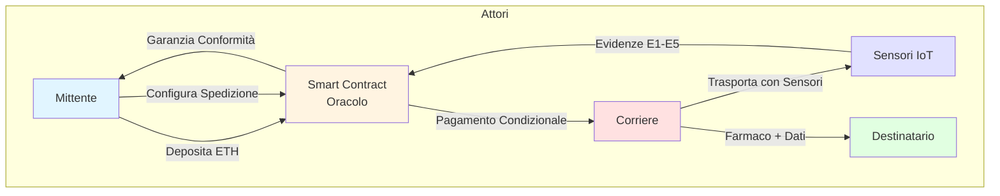

### Strategic Rationale (SR) Model - Mittente TO-BE

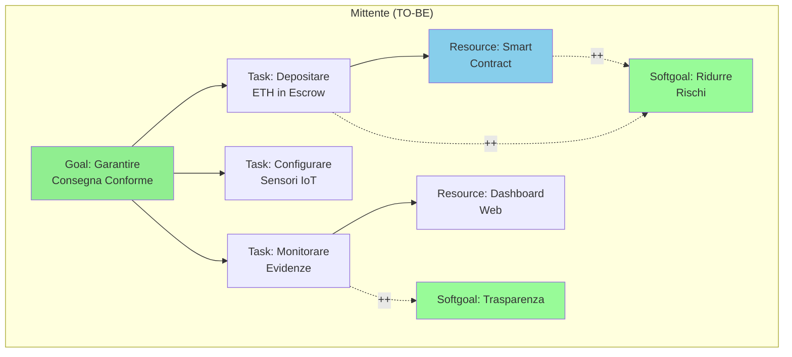

**Miglioramenti (TO-BE):**
- ✅ **Garanzia Crittografica**: Smart contract garantisce conformità
- ✅ **Monitoraggio Real-Time**: Visibilità completa su temperatura/integrità
- ✅ **Pagamento Condizionale**: ETH rilasciato solo se P(F1,F2) ≥ 95%
- ✅ **Dispute Resolution**: Evidenze immutabili on-chain
- ✅ **Riduzione Rischi**: Incentivi allineati

### Strategic Rationale (SR) Model - Corriere TO-BE

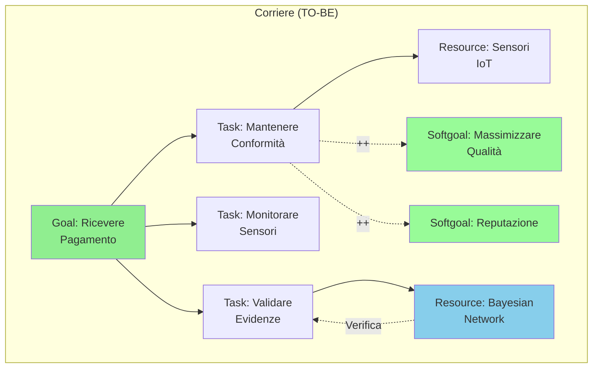

**Miglioramenti (TO-BE):**
- ✅ **Incentivi Allineati**: Pagato SOLO se conforme
- ✅ **Responsabilità Chiara**: Evidenze provano negligenza
- ✅ **Reputazione On-Chain**: Storia trasparente
- ✅ **Qualità Premiata**: Migliore servizio = più contratti

---

## 3. SD/SR Sistema e Attaccanti

### Strategic Dependency (SD) Model - Attaccanti

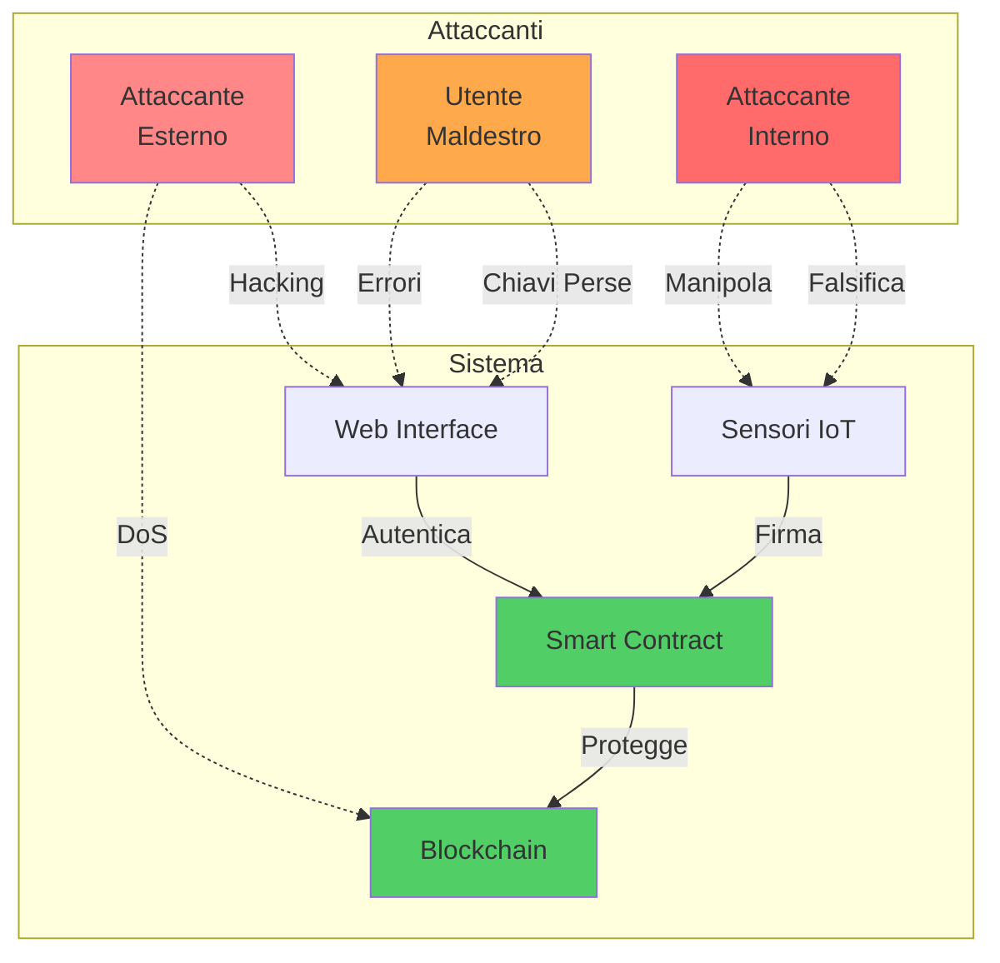

### Strategic Rationale (SR) - Attaccante Interno

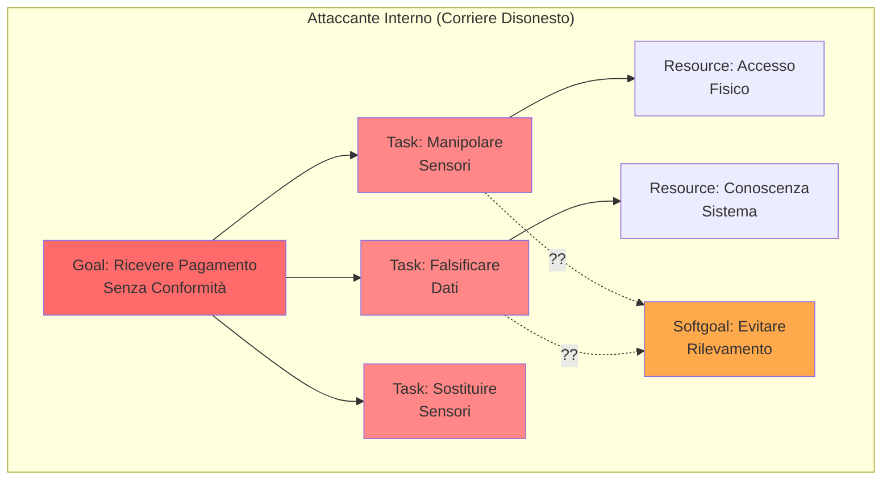

**Contromisure:**
- 🛡️ **Firma Crittografica**: Sensori firmano dati con chiave privata
- 🛡️ **Tamper-Evident Seals**: Sigilli antimanomissione
- 🛡️ **Ridondanza**: Multipli sensori cross-validano
- 🛡️ **Bayesian Network**: Rileva incoerenze statistiche

### Strategic Rationale (SR) - Attaccante Esterno

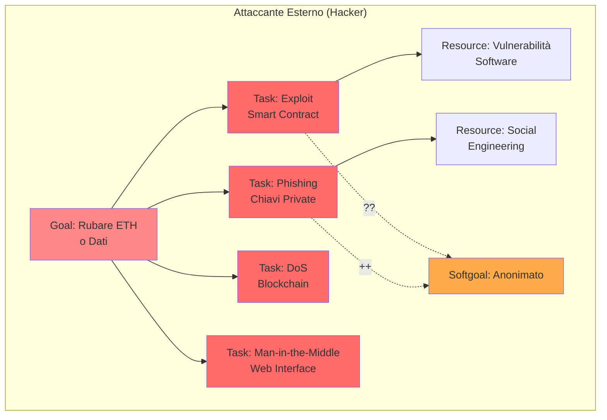

**Contromisure:**
- 🛡️ **Audit Smart Contract**: OpenZeppelin, formal verification
- 🛡️ **HTTPS/TLS**: Crittografia end-to-end
- 🛡️ **Rate Limiting**: Protezione DoS
- 🛡️ **MetaMask**: Gestione sicura chiavi private
- 🛡️ **Immutabilità Blockchain**: Dati non modificabili

### Strategic Rationale (SR) - Utente Maldestro

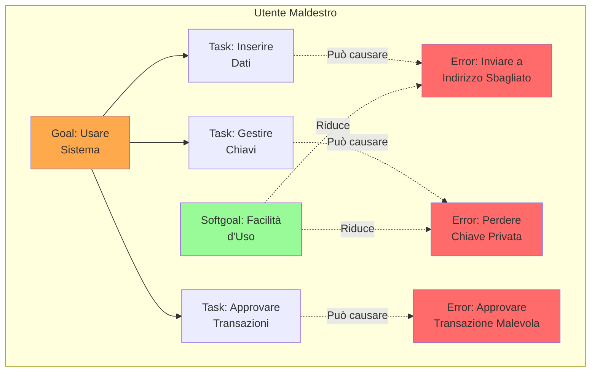

**Contromisure:**
- 🛡️ **UI Intuitiva**: Design chiaro e guidato
- 🛡️ **Validazione Input**: Controlli pre-transazione
- 🛡️ **Conferme Multiple**: "Sei sicuro?" per azioni critiche
- 🛡️ **Recovery Seed**: Backup chiave privata
- 🛡️ **Messaggi Chiari**: Errori comprensibili

---

## 4. Alberi di Attacco

### 4.1 Albero di Attacco - Attaccante Interno

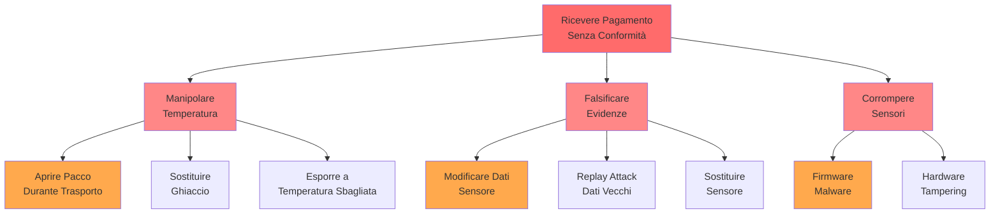

**Contromisure per Ogni Nodo:**

| Attacco | Contromisura | Implementazione |
|---------|--------------|-----------------|
| **A1_1**: Aprire Pacco | Sigillo Elettronico (E2) | Sensore luce (E4) rileva apertura |
| **A1_2**: Sostituire Ghiaccio | Logger Temperatura (E1) | Monitoraggio continuo 2-8°C |
| **A1_3**: Temperatura Sbagliata | Bayesian Network | P(F1\|E) < 95% → Pagamento negato |
| **A2_1**: Modificare Dati | Firma Crittografica | Sensori firmano con chiave privata |
| **A2_2**: Replay Attack | Timestamp (E5) | Verifica temporale coerente |
| **A2_3**: Sostituire Sensore | Certificato Sensore | Whitelist sensori autorizzati |
| **A3_1**: Firmware Malware | Secure Boot | Firmware verificato all'avvio |
| **A3_2**: Hardware Tampering | Tamper-Evident Seal | Sigillo fisico antimanomissione |

### 4.2 Albero di Attacco - Attaccante Esterno

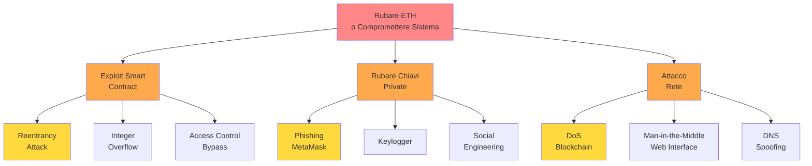

**Contromisure per Ogni Nodo:**

| Attacco | Contromisura | Implementazione |
|---------|--------------|-----------------|
| **B1_1**: Reentrancy | Checks-Effects-Interactions | Pattern Solidity sicuro |
| **B1_2**: Integer Overflow | SafeMath / Solidity 0.8+ | Controlli automatici overflow |
| **B1_3**: Access Control | OpenZeppelin AccessControl | Modifier `onlyRole()` |
| **B2_1**: Phishing | Educazione Utenti | Warning su transazioni sospette |
| **B2_2**: Keylogger | Hardware Wallet | Ledger/Trezor per chiavi critiche |
| **B2_3**: Social Engineering | 2FA / Multi-sig | Richiede multiple approvazioni |
| **B3_1**: DoS Blockchain | Gas Limit / Rate Limiting | Limiti per transazione |
| **B3_2**: MITM | HTTPS/TLS | Certificato SSL valido |
| **B3_3**: DNS Spoofing | DNSSEC / IPFS | Hosting decentralizzato |

### 4.3 Albero di Attacco - Utente Maldestro

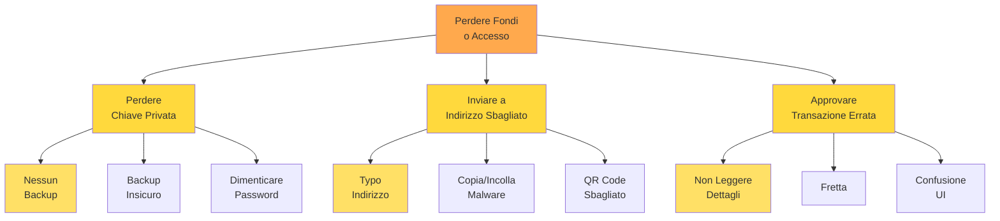

**Contromisure per Ogni Nodo:**

| Errore | Contromisura | Implementazione |
|--------|--------------|-----------------|
| **C1_1**: Nessun Backup | Recovery Seed Obbligatorio | MetaMask forza backup seed |
| **C1_2**: Backup Insicuro | Educazione Sicurezza | Tutorial su storage sicuro |
| **C1_3**: Password Dimenticata | Password Manager | Suggerimento uso 1Password/Bitwarden |
| **C2_1**: Typo Indirizzo | Checksum Validation | Verifica checksum Ethereum |
| **C2_2**: Malware Clipboard | Conferma Visiva | Mostra indirizzo completo |
| **C2_3**: QR Code Sbagliato | Doppia Verifica | Mostra indirizzo + QR |
| **C3_1**: Non Leggere | UI Chiara | Highlight info critiche |
| **C3_2**: Fretta | Cooldown Period | Ritardo 5s per conferma |
| **C3_3**: Confusione UI | UX Testing | Design intuitivo e testato |

---

## 5. Matrice di Rischio

### Valutazione Rischi Pre-Mitigazione

| Attacco | Probabilità | Impatto | Rischio | Priorità |
|---------|-------------|---------|---------|----------|
| Manipolazione Sensori | Alta | Alto | **Critico** | 🔴 P1 |
| Exploit Smart Contract | Media | Critico | **Alto** | 🟠 P2 |
| Phishing Chiavi | Alta | Alto | **Critico** | 🔴 P1 |
| Perdita Chiave Privata | Alta | Medio | **Alto** | 🟠 P2 |
| DoS Blockchain | Bassa | Medio | **Medio** | 🟡 P3 |
| Typo Indirizzo | Media | Medio | **Medio** | 🟡 P3 |

### Valutazione Rischi Post-Mitigazione

| Attacco | Probabilità | Impatto | Rischio Residuo | Status |
|---------|-------------|---------|-----------------|--------|
| Manipolazione Sensori | Bassa | Alto | **Medio** | ✅ Mitigato |
| Exploit Smart Contract | Molto Bassa | Critico | **Basso** | ✅ Mitigato |
| Phishing Chiavi | Media | Alto | **Medio** | ⚠️ Monitorare |
| Perdita Chiave Privata | Bassa | Medio | **Basso** | ✅ Mitigato |
| DoS Blockchain | Molto Bassa | Medio | **Basso** | ✅ Mitigato |
| Typo Indirizzo | Bassa | Medio | **Basso** | ✅ Mitigato |

---

## 6. Conclusioni

### Miglioramenti Chiave del Sistema

1. **Allineamento Incentivi**: Pagamento condizionale elimina moral hazard
2. **Trasparenza**: Evidenze immutabili on-chain
3. **Automazione**: Smart contract elimina intermediari
4. **Sicurezza Multi-Livello**: Crittografia + Bayesian Network + IoT
5. **Responsabilità Chiara**: Evidenze provano negligenza

### Raccomandazioni Finali

| Area | Raccomandazione | Priorità |
|------|-----------------|----------|
| **Sensori** | Implementare firma crittografica | 🔴 Alta |
| **Smart Contract** | Audit formale da terze parti | 🔴 Alta |
| **UI/UX** | User testing con utenti reali | 🟠 Media |
| **Backup** | Sistema recovery multi-firma | 🟠 Media |
| **Monitoring** | Dashboard real-time anomalie | 🟡 Bassa |

---

**Documento creato per**: Progetto Software Security  
**Data**: 24 Novembre 2024  
**Versione**: 1.0
