# 📖 Manuale Utente - Sistema Oracolo Bayesiano

**Sistema Blockchain per Catena del Freddo Farmaceutica**

---

## 📋 Indice

1. [Panoramica del Sistema](#panoramica-del-sistema)
2. [Architettura e Componenti](#architettura-e-componenti)
3. [Ruoli e Permessi](#ruoli-e-permessi)
4. [Connessione Wallet](#connessione-wallet)
5. [Funzionalità per Ruolo](#funzionalità-per-ruolo)
6. [Scenari d'Uso Completi](#scenari-duso-completi)
7. [Interpretazione Risultati](#interpretazione-risultati)
8. [Best Practices](#best-practices)

---

## 🎯 Panoramica del Sistema

Il **Sistema Oracolo Bayesiano** è una piattaforma blockchain che garantisce la conformità delle spedizioni farmaceutiche attraverso:

- **Smart Contract Ethereum**: Gestisce escrow payments e validazione automatica
- **Bayesian Network**: Calcola la probabilità di conformità basandosi su evidenze IoT
- **Sensori IoT**: Monitorano 5 parametri critici durante il trasporto
- **Web Interface**: Dashboard intuitiva per tutti gli stakeholder

### Come Funziona

```mermaid
graph LR
    A[Mittente crea spedizione] --> B[Deposita ETH nel contratto]
    B --> C[Sensori inviano evidenze E1-E5]
    C --> D[Contratto calcola P F1, F2]
    D --> E{P >= 95%?}
    E -->|Sì| F[Corriere riceve pagamento]
    E -->|No| G[Pagamento rifiutato]
```



### Vantaggi

✅ **Trasparenza**: Tutte le transazioni sono registrate on-chain  
✅ **Sicurezza**: Pagamento garantito solo se condizioni rispettate  
✅ **Automazione**: Nessun intermediario necessario  
✅ **Tracciabilità**: Storico completo di ogni spedizione  
✅ **Conformità**: Validazione automatica basata su dati reali

---

## 🏗️ Architettura e Componenti

### Componenti Principali

```
┌─────────────┐      ┌──────────────┐      ┌─────────────┐
│  Mittente   │─────▶│Smart Contract│◀─────│  Corriere   │
│ (Farmacia)  │      │  (Ethereum)  │      │ (Trasporto) │
└─────────────┘      └──────────────┘      └─────────────┘
                            ▲
                            │
                     ┌──────┴──────┐
                     │ Sensori IoT │
                     │   E1 - E5   │
                     └─────────────┘
```

### Evidenze Monitorate

| ID | Nome | Descrizione | Valore Conforme |
|----|------|-------------|-----------------|
| **E1** | Temperatura | Temperatura nel range corretto | ✅ True |
| **E2** | Sigillo | Sigillo di sicurezza intatto | ✅ True |
| **E3** | Shock | Assenza di urti violenti | ❌ False |
| **E4** | Luce | Assenza di esposizione alla luce | ❌ False |
| **E5** | Scan Arrivo | Scansione all'arrivo effettuata | ✅ True |

### Bayesian Network

Il sistema calcola due probabilità:

- **P(F1=True | E1...E5)**: Probabilità che la temperatura sia stata conforme
- **P(F2=True | E1...E5)**: Probabilità che l'imballaggio sia integro

**Condizione per il pagamento**: Entrambe le probabilità devono essere ≥ 95%

---

## 👥 Ruoli e Permessi

### Tabella Ruoli

| Ruolo | Descrizione | Permessi | Account Default |
|-------|-------------|----------|-----------------|
| **Admin/Oracolo** | Amministratore del sistema | Imposta probabilità a priori e CPT | `accounts[0]` |
| **Mittente** | Crea spedizioni e deposita pagamenti | Crea spedizioni, deposita ETH | `accounts[0]`, `accounts[2]` |
| **Sensore** | Invia evidenze dai dispositivi IoT | Invia evidenze E1-E5 | `accounts[0]`, `accounts[1]` |
| **Corriere** | Trasporta e valida spedizioni | Valida spedizione e riceve pagamento | Qualsiasi account |

> **Nota**: `accounts[0]` ha tutti i ruoli per facilitare il testing. In produzione, ogni ruolo sarebbe assegnato a account separati.

---

## 🔌 Connessione Wallet

### Primo Accesso

1. **Apri l'interfaccia web**: http://localhost:8000
2. **Clicca "Connect Wallet"** nel banner in alto
3. **Approva la connessione** in MetaMask quando richiesto
4. **Verifica la connessione**: Il tuo indirizzo Ethereum apparirà nel banner

### Cambio Account

Per testare diversi ruoli:

1. **In MetaMask**: Clicca sull'icona dell'account
2. **Seleziona un altro account** dalla lista
3. **Ricarica la pagina** del browser
4. **Riconnetti il wallet** cliccando "Connect Wallet"

### Disconnessione

- Clicca **"Disconnect"** nel banner
- Oppure disconnetti direttamente da MetaMask

---

## 🎭 Funzionalità per Ruolo

## 👑 Admin/Oracolo

### Pannello Admin

Il pannello Admin permette di configurare i parametri della Bayesian Network.

### Impostare Probabilità A Priori

Le probabilità a priori rappresentano la conoscenza iniziale prima di ricevere evidenze.

**Campi:**
- **P(F1=True)**: Probabilità iniziale che la temperatura sia conforme (0-100)
- **P(F2=True)**: Probabilità iniziale che l'imballaggio sia integro (0-100)

**Valori Default**: 90 per entrambi

**Procedura:**
1. Vai al pannello **"Admin/Oracolo"**
2. Inserisci i valori desiderati (es. 90, 90)
3. Clicca **"Imposta Probabilità A Priori"**
4. Approva la transazione in MetaMask
5. Attendi la conferma

### Configurare CPT (Conditional Probability Tables)

Le CPT definiscono come le evidenze influenzano le probabilità.

**Nota**: Le CPT sono già configurate automaticamente durante il deploy. Questa funzionalità è disponibile per aggiornamenti futuri.

---

## 📦 Mittente

### Creare una Spedizione

**Prerequisiti:**
- Account con ruolo MITTENTE
- ETH sufficiente per il pagamento + gas

**Procedura:**

1. **Vai al pannello "Mittente"**

2. **Compila il form**:
   - **Indirizzo Corriere**: Indirizzo Ethereum del corriere (es. `0x70997970C51812dc3A010C7d01b50e0d17dc79C8`)
   - **Importo Pagamento**: Quantità di ETH da depositare (es. `1`)

3. **Clicca "Crea Spedizione"**

4. **Approva in MetaMask**:
   - Verifica l'importo
   - Verifica il gas fee
   - Clicca "Conferma"

5. **Attendi conferma**:
   - Apparirà un toast di successo
   - La spedizione apparirà nella lista con ID univoco
   - Lo stato sarà "In Attesa"

**Cosa Succede:**
- L'importo ETH viene bloccato nel contratto (escrow)
- Viene creato un record della spedizione on-chain
- Il corriere viene registrato
- La spedizione è pronta per ricevere evidenze

### Visualizzare Spedizioni

Nella sezione **"Elenco Spedizioni"** puoi vedere:
- **ID Spedizione**: Numero univoco
- **Corriere**: Indirizzo del corriere
- **Importo**: ETH depositato
- **Stato**: In Attesa / Pagata
- **Evidenze**: Quali evidenze sono state ricevute (✅/❌)

---

## 📡 Sensore

### Inviare Evidenze

**Prerequisiti:**
- Account con ruolo SENSORE
- ID della spedizione da monitorare
- Spedizione non ancora pagata

**Procedura:**

1. **Vai al pannello "Sensore"**

2. **Inserisci ID Spedizione**: Numero della spedizione (es. `1`)

3. **Per ogni evidenza (E1-E5)**:

   a. **Seleziona il valore**:
      - ✅ **True**: Condizione conforme
      - ❌ **False**: Condizione non conforme
   
   b. **Clicca il pulsante corrispondente** (es. "Invia E1")
   
   c. **Approva in MetaMask**
   
   d. **Attendi conferma**: Apparirà un toast di successo

4. **Ripeti per tutte e 5 le evidenze**

### Interpretazione Evidenze

| Evidenza | True (✅) | False (❌) |
|----------|-----------|------------|
| **E1** | Temperatura nel range | Temperatura fuori range |
| **E2** | Sigillo intatto | Sigillo rotto |
| **E3** | Shock rilevato | Nessuno shock |
| **E4** | Esposizione luce | Nessuna esposizione |
| **E5** | Scan arrivo OK | Scan non effettuato |

### Scenario Conforme (Pagamento Approvato)

```
E1: ✅ True  (Temperatura OK)
E2: ✅ True  (Sigillo intatto)
E3: ❌ False (Nessuno shock)
E4: ❌ False (Nessuna luce)
E5: ✅ True  (Scan OK)
```

### Scenario Non Conforme (Pagamento Rifiutato)

```
E1: ❌ False (Temperatura fuori range) ⚠️
E2: ✅ True  (Sigillo intatto)
E3: ✅ True  (Shock rilevato) ⚠️
E4: ❌ False (Nessuna luce)
E5: ✅ True  (Scan OK)
```

---

## 🚚 Corriere

### Validare e Ricevere Pagamento

**Prerequisiti:**
- Essere il corriere assegnato alla spedizione
- Tutte e 5 le evidenze devono essere state inviate
- La spedizione non deve essere già stata pagata

**Procedura:**

1. **Cambia account in MetaMask**:
   - Seleziona l'account del corriere
   - Ricarica la pagina
   - Riconnetti il wallet

2. **Vai al pannello "Corriere"**

3. **Inserisci ID Spedizione**: Numero della spedizione (es. `1`)

4. **Clicca "Valida e Ricevi Pagamento"**

5. **Approva in MetaMask**

6. **Attendi il risultato**:

   **✅ Successo (Conformità Rispettata)**:
   - Toast: "Pagamento di X ETH ricevuto con successo!"
   - L'ETH viene trasferito al tuo wallet
   - Lo stato della spedizione diventa "Pagata"
   
   **❌ Errore (Conformità Non Rispettata)**:
   - Errore: "Requisiti di conformità non superati"
   - L'ETH rimane bloccato nel contratto
   - Lo stato rimane "In Attesa"

### Cosa Controlla il Contratto

Il contratto calcola automaticamente:

```
P(F1=True | E1, E2, E3, E4, E5) >= 95%
P(F2=True | E1, E2, E3, E4, E5) >= 95%
```

Se **entrambe** le condizioni sono soddisfatte → **Pagamento approvato** ✅  
Se **almeno una** condizione fallisce → **Pagamento rifiutato** ❌

---

## 🎬 Scenari d'Uso Completi

### Scenario 1: Spedizione Conforme (Happy Path)

**Obiettivo**: Testare il flusso completo con evidenze corrette.

#### Step 1: Creazione Spedizione (Mittente)

**Account**: `accounts[0]`

1. Apri interfaccia web
2. Connetti wallet
3. Vai a pannello "Mittente"
4. Inserisci:
   - Corriere: `0x70997970C51812dc3A010C7d01b50e0d17dc79C8`
   - Importo: `1` ETH
5. Clicca "Crea Spedizione"
6. Approva in MetaMask

**Risultato atteso**: 
- ✅ Toast: "Spedizione #1 creata con successo!"
- ✅ Spedizione appare nella lista con stato "In Attesa"

#### Step 2: Invio Evidenze (Sensore)

**Account**: `accounts[0]` (ha ruolo SENSORE)

1. Vai a pannello "Sensore"
2. Inserisci ID: `1`
3. Invia evidenze:
   - E1: ✅ True → Clicca "Invia E1" → Approva
   - E2: ✅ True → Clicca "Invia E2" → Approva
   - E3: ❌ False → Clicca "Invia E3" → Approva
   - E4: ❌ False → Clicca "Invia E4" → Approva
   - E5: ✅ True → Clicca "Invia E5" → Approva

**Risultato atteso**:
- ✅ 5 toast di successo
- ✅ Nella lista spedizioni, tutte le evidenze sono verdi (✅)

#### Step 3: Validazione Pagamento (Corriere)

**Account**: Cambia a `0x70997970C51812dc3A010C7d01b50e0d17dc79C8`

1. In MetaMask, seleziona account corriere
2. Ricarica pagina e riconnetti wallet
3. Vai a pannello "Corriere"
4. Inserisci ID: `1`
5. Clicca "Valida e Ricevi Pagamento"
6. Approva in MetaMask

**Risultato atteso**:
- ✅ Toast: "Pagamento di 1 ETH ricevuto con successo!"
- ✅ Stato spedizione diventa "Pagata"
- ✅ Il corriere riceve 1 ETH nel wallet

---

### Scenario 2: Spedizione Non Conforme (Evidenze Sbagliate)

**Obiettivo**: Testare il rifiuto del pagamento con evidenze non conformi.

#### Step 1: Creazione Spedizione

Come Scenario 1, Step 1.

#### Step 2: Invio Evidenze NON Conformi

**Account**: `accounts[0]`

1. Vai a pannello "Sensore"
2. Inserisci ID: `2` (nuova spedizione)
3. Invia evidenze:
   - E1: ❌ **False** (Temperatura fuori range!) ⚠️
   - E2: ✅ True
   - E3: ✅ **True** (Shock rilevato!) ⚠️
   - E4: ❌ False
   - E5: ✅ True

#### Step 3: Tentativo di Validazione

**Account**: Corriere

1. Cambia account
2. Vai a pannello "Corriere"
3. Inserisci ID: `2`
4. Clicca "Valida e Ricevi Pagamento"

**Risultato atteso**:
- ❌ Errore: "Requisiti di conformità non superati"
- ❌ Nessun ETH trasferito
- ❌ Stato rimane "In Attesa"

---

### Scenario 3: Test di Sicurezza - Evidenze Dopo Pagamento

**Obiettivo**: Verificare che non si possano inviare evidenze dopo il pagamento.

#### Procedura

1. Completa Scenario 1 (spedizione pagata)
2. Prova a inviare un'altra evidenza per la spedizione #1
3. Vai a pannello "Sensore"
4. Inserisci ID: `1`
5. Prova a inviare E1 di nuovo

**Risultato atteso**:
- ❌ Errore: "La spedizione è già stata pagata"
- ❌ Transazione rifiutata

---

### Scenario 4: Test di Sicurezza - Validazione Senza Evidenze Complete

**Obiettivo**: Verificare che servano tutte e 5 le evidenze.

#### Procedura

1. Crea nuova spedizione (#3)
2. Invia solo 3 evidenze (E1, E2, E3)
3. Cambia account al corriere
4. Prova a validare

**Risultato atteso**:
- ❌ Errore: "Non tutte le evidenze sono state inviate"
- ❌ Pagamento rifiutato

---

### Scenario 5: Test di Sicurezza - Validazione da Account Sbagliato

**Obiettivo**: Verificare che solo il corriere assegnato possa validare.

#### Procedura

1. Crea spedizione con corriere = `accounts[3]`
2. Invia tutte le evidenze
3. **NON** cambiare account (resta su `accounts[0]`)
4. Prova a validare

**Risultato atteso**:
- ❌ Errore: "Solo il corriere può validare e ricevere il pagamento"
- ❌ Transazione rifiutata

---

## 📊 Interpretazione Risultati

### Messaggi di Successo

| Messaggio | Significato |
|-----------|-------------|
| "Spedizione #X creata con successo!" | Spedizione registrata on-chain, ETH depositato |
| "Evidenza EX inviata con successo!" | Evidenza registrata, contribuisce al calcolo BN |
| "Pagamento di X ETH ricevuto con successo!" | Validazione superata, pagamento trasferito |
| "Probabilità a priori impostate con successo!" | Parametri BN aggiornati |

### Messaggi di Errore

| Errore | Causa | Soluzione |
|--------|-------|-----------|
| "Contract not deployed" | Contratto non trovato | Esegui `truffle migrate --reset` |
| "User rejected the request" | Transazione rifiutata in MetaMask | Riprova e approva |
| "Insufficient funds" | ETH insufficiente | Usa account con più ETH |
| "Requisiti di conformità non superati" | P(F1) o P(F2) < 95% | Evidenze indicano non conformità |
| "La spedizione è già stata pagata" | Tentativo di modificare spedizione chiusa | Crea nuova spedizione |
| "Non tutte le evidenze sono state inviate" | Mancano evidenze | Invia tutte e 5 le evidenze |
| "Solo il corriere può validare..." | Account sbagliato | Usa account del corriere |
| "Returned error: Internal JSON-RPC error" | Vari (vedi sotto) | Controlla console browser |

### Debug "Internal JSON-RPC error"

Questo errore generico può avere diverse cause:

1. **Apri Console Browser** (F12)
2. **Cerca l'errore dettagliato** in rosso
3. **Possibili cause**:
   - Ruolo mancante → Usa `accounts[0]`
   - Gas insufficiente → Aumenta gas limit
   - Parametri sbagliati → Verifica input
   - Contratto non deployato → Esegui `truffle migrate --reset`

---

## ✅ Best Practices

### Per Mittenti

✅ **Verifica l'indirizzo del corriere** prima di creare la spedizione  
✅ **Deposita l'importo corretto** (considera anche i costi di trasporto)  
✅ **Annota l'ID della spedizione** per il tracking  
✅ **Monitora lo stato** tramite l'interfaccia web  

### Per Sensori

✅ **Invia evidenze in ordine** (E1 → E2 → E3 → E4 → E5)  
✅ **Verifica i valori** prima di inviare (non sono modificabili!)  
✅ **Attendi conferma** di ogni transazione prima della successiva  
✅ **Controlla la lista spedizioni** per vedere le evidenze registrate  

### Per Corrieri

✅ **Attendi tutte e 5 le evidenze** prima di validare  
✅ **Verifica lo stato** nella lista spedizioni  
✅ **Usa l'account corretto** (quello assegnato come corriere)  
✅ **Controlla il saldo ETH** prima e dopo la validazione  

### Sicurezza

🔒 **Non condividere mai le chiavi private** di MetaMask  
🔒 **Usa account separati** per ruoli diversi in produzione  
🔒 **Verifica sempre l'indirizzo del contratto** prima di interagire  
🔒 **Fai backup** delle chiavi private in modo sicuro  
🔒 **Testa su Ganache** prima di usare rete mainnet  

### Performance

⚡ **Aumenta il gas price** se le transazioni sono lente  
⚡ **Attendi la conferma** prima di fare altre operazioni  
⚡ **Usa hard refresh** (Ctrl+Shift+R) dopo aggiornamenti  
⚡ **Pulisci cache browser** se l'interfaccia non si aggiorna  

---

## 📈 Metriche di Sistema

### Gas Costs (Approssimativi)

| Operazione | Gas Stimato | Costo ETH (20 Gwei) |
|------------|-------------|----------------------|
| Crea Spedizione | ~150,000 | ~0.003 ETH |
| Invia Evidenza | ~50,000 | ~0.001 ETH |
| Valida Pagamento | ~200,000 | ~0.004 ETH |
| Imposta Probabilità | ~80,000 | ~0.0016 ETH |

### Tempi di Risposta

| Operazione | Tempo Atteso |
|------------|--------------|
| Connessione Wallet | < 2 secondi |
| Caricamento Contratto | < 1 secondo |
| Conferma Transazione | 1-5 secondi (Ganache) |
| Aggiornamento UI | < 1 secondo |

---

## 🎓 Glossario

**ABI (Application Binary Interface)**: Interfaccia che permette alla web app di comunicare con il contratto

**Bayesian Network**: Modello probabilistico che calcola P(F1, F2 | E1...E5)

**Chain ID**: Identificatore univoco della blockchain (1337 per Ganache)

**CPT (Conditional Probability Table)**: Tabella che definisce P(Figlio | Genitori)

**Escrow**: Meccanismo che blocca fondi fino al soddisfacimento di condizioni

**Evidenza**: Dato inviato da un sensore IoT (E1-E5)

**Gas**: Costo computazionale di una transazione Ethereum

**Ganache**: Blockchain Ethereum locale per sviluppo e testing

**MetaMask**: Wallet Ethereum per browser

**Smart Contract**: Programma auto-eseguibile sulla blockchain

**Truffle**: Framework per sviluppo Ethereum

**Web3.js**: Libreria JavaScript per interagire con Ethereum

---

## 📞 Supporto

Per assistenza:

- **Guida Installazione**: Vedi `GUIDA_INSTALLAZIONE_E_TROUBLESHOOTING.md`
- **Repository**: [github.com/lucabelard/ProgettoSoftwareSecurity](https://github.com/lucabelard/ProgettoSoftwareSecurity)
- **Issues**: Apri un issue su GitHub per bug o domande

---

**Versione**: 2.0  
**Data**: 27 Novembre 2024  
**Autore**: Luca Belard
