# Diagramma i* - Sistema Blockchain per Spedizioni

## Visualizzazione delle Dipendenze

```mermaid
graph TB
    %% Definizione Attori
    Mittente[("👤 Mittente")]
    Corriere[("🚚 Corriere")]
    Sensore[("📡 Sensore")]
    Admin[("👨‍💼 Admin")]
    Sistema[("⛓️ Sistema_Blockchain")]
    
    %% Dipendenze Mittente -> Sistema_Blockchain
    Mittente -->|"[task]<br/>Creazione Spedizione"| Sistema
    Mittente -->|"[goal]<br/>Validazione Evidenze"| Sistema
    Mittente -->|"[task]<br/>Pagamento Automatico"| Sistema
    Mittente -->|"[softgoal]<br/>Tracciabilità Immutabile"| Sistema
    
    %% Dipendenze Corriere -> Sistema_Blockchain
    Corriere -->|"[task]<br/>Registrazione Consegna"| Sistema
    Corriere -->|"[goal]<br/>Ricezione Pagamento"| Sistema
    Corriere -->|"[resource]<br/>Prova di Conformità"| Sistema
    
    %% Dipendenze Sensore -> Sistema_Blockchain
    Sensore -->|"[task]<br/>Invio Dati Ambientali"| Sistema
    Sensore -->|"[resource]<br/>Timestamp Certificato"| Sistema
    
    %% Dipendenze Admin -> Sistema_Blockchain
    Admin -->|"[task]<br/>Gestione Ruoli"| Sistema
    Admin -->|"[task]<br/>Validazione Manuale Evidenze"| Sistema
    
    %% Dipendenze Sistema_Blockchain -> Admin
    Sistema -->|"[goal]<br/>Approvazione Evidenze"| Admin
    Sistema -->|"[task]<br/>Configurazione Sistema"| Admin
    
    %% Dipendenze Sistema_Blockchain -> Sensore
    Sistema -->|"[softgoal]<br/>Dati Affidabili"| Sensore
    Sistema -->|"[resource]<br/>Letture Ambientali"| Sensore
    
    %% Dipendenze Sistema_Blockchain -> Corriere
    Sistema -->|"[resource]<br/>Conferma Consegna"| Corriere
    
    %% Dipendenze Mittente <-> Corriere
    Mittente -->|"[goal]<br/>Consegna Fisica Merce"| Corriere
    Corriere -->|"[resource]<br/>Informazioni Destinatario"| Mittente
    
    style Mittente fill:#e1f5ff,stroke:#01579b,stroke-width:2px
    style Corriere fill:#fff3e0,stroke:#e65100,stroke-width:2px
    style Sensore fill:#f3e5f5,stroke:#4a148c,stroke-width:2px
    style Admin fill:#e8f5e9,stroke:#1b5e20,stroke-width:2px
    style Sistema fill:#fff9c4,stroke:#f57f17,stroke-width:4px
```

## Legenda Tipi di Dipendenza

- **[task]** - Compito specifico da eseguire
- **[goal]** - Obiettivo da raggiungere
- **[softgoal]** - Obiettivo non funzionale (qualità)
- **[resource]** - Risorsa informativa o fisica

## Riepilogo Dipendenze per Attore

### Mittente
**Dipende da Sistema_Blockchain per:**
- Creazione Spedizione [task]
- Validazione Evidenze [goal]
- Pagamento Automatico [task]
- Tracciabilità Immutabile [softgoal]

**Dipende da Corriere per:**
- Consegna Fisica Merce [goal]

**Fornisce a Corriere:**
- Informazioni Destinatario [resource]

### Corriere
**Dipende da Sistema_Blockchain per:**
- Registrazione Consegna [task]
- Ricezione Pagamento [goal]
- Prova di Conformità [resource]

**Fornisce a Sistema_Blockchain:**
- Conferma Consegna [resource]

**Fornisce a Mittente:**
- Consegna Fisica Merce [goal]

**Dipende da Mittente per:**
- Informazioni Destinatario [resource]

### Sensore
**Dipende da Sistema_Blockchain per:**
- Invio Dati Ambientali [task]
- Timestamp Certificato [resource]

**Fornisce a Sistema_Blockchain:**
- Dati Affidabili [softgoal]
- Letture Ambientali [resource]

### Admin
**Dipende da Sistema_Blockchain per:**
- Gestione Ruoli [task]
- Validazione Manuale Evidenze [task]

**Fornisce a Sistema_Blockchain:**
- Approvazione Evidenze [goal]
- Configurazione Sistema [task]

### Sistema_Blockchain
**Dipende da Admin per:**
- Approvazione Evidenze [goal]
- Configurazione Sistema [task]

**Dipende da Sensore per:**
- Dati Affidabili [softgoal]
- Letture Ambientali [resource]

**Dipende da Corriere per:**
- Conferma Consegna [resource]
