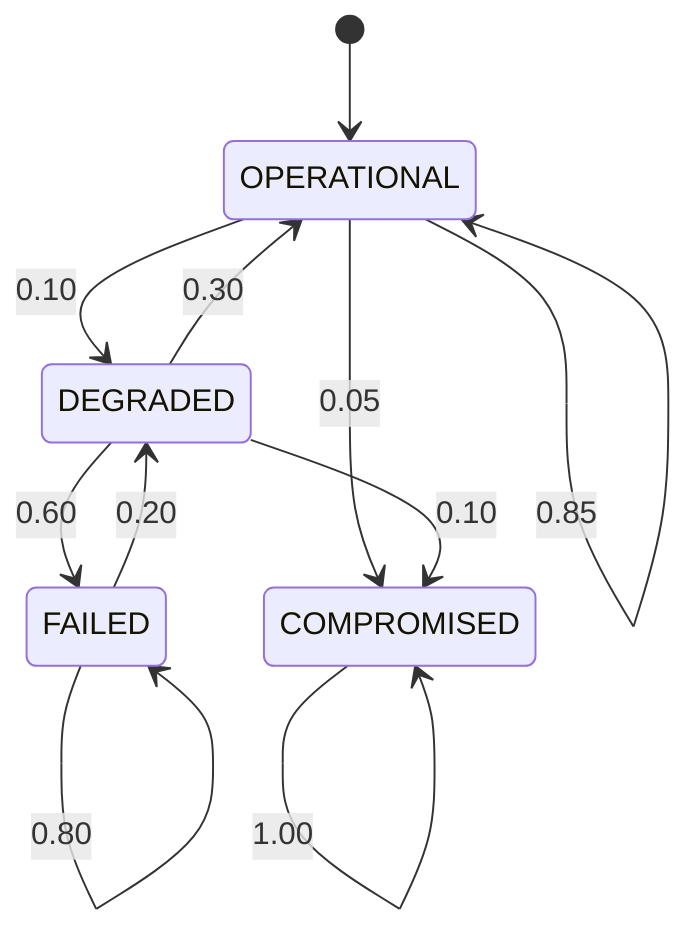

# Design degli Asset e Verifica Formale
## Sistema Oracolo Bayesiano per Catena del Freddo Farmaceutica

**Data**: Dicembre 2024

---

## 1. Design degli Asset

### 1.1 Asset Critici del Sistema

| ID | Asset | Criticità |
|----|-------|-----------|
| **A1** | Smart Contract `BNCalcolatoreOnChain` | 🔴 Critica |
| **A2** | Evidenze IoT (E1-E5) | 🔴 Critica |
| **A3** | Pagamenti ETH (Escrow) | 🔴 Critica |
| **A4** | Ruoli e Permessi (AccessControl) | 🟠 Alta |
| **A5** | CPT e Probabilità Bayesiane | 🟠 Alta |

---

## 2. Applicazione Principi di Sicurezza

### 2.1 Saltzer & Schroeder

#### Economy of Mechanism
Il contratto usa precisione fissa (PRECISIONE = 100) e solo 2 fatti (F1, F2) invece di un modello complesso.

```solidity
uint256 public constant PRECISIONE = 100;
uint256 public p_F1_T;
uint256 public p_F2_T;
```

#### Fail-Safe Defaults
Accesso negato per default, permesso solo con ruolo esplicito.

```solidity
function inviaEvidenza(...) external onlyRole(RUOLO_SENSORE) {
    // Accesso solo con ruolo autorizzato
}
```

#### Complete Mediation
Ogni accesso viene verificato con controlli multipli.

```solidity
function validaEPaga(uint256 _id) external {
    require(s.corriere == msg.sender, "Non sei il corriere");
    require(s.stato == StatoSpedizione.InAttesa, "...");
    require(evidenze complete, "...");
    require(probF1 >= 95 && probF2 >= 95, "...");
}
```

#### Least Privilege
Ogni ruolo ha solo i privilegi necessari.

| Ruolo | Privilegi |
|-------|-----------|
| ORACOLO | Imposta CPT |
| SENSORE | Invia evidenze |
| MITTENTE | Crea spedizioni |

---

### 2.2 Linee Guida OWASP

#### OWASP Smart Contracts

**SC01 - Reentrancy**: ✅ Protetto con pattern Checks-Effects-Interactions

```solidity
s.stato = StatoSpedizione.Pagata; // Stato prima della chiamata esterna
(bool success, ) = s.corriere.call{value: importo}("");
```

**SC02 - Access Control**: ✅ Protetto con OpenZeppelin AccessControl

#### OWASP IoT

**Raccomandazioni implementate**:
- Whitelist sensori autorizzati
- Autenticazione tramite ruoli blockchain
- Evidenze immutabili on-chain

---

### 2.3 Principi di Sommerville

#### Security by Design
Analisi i* e attack trees eseguiti prima dell'implementazione.

#### Defense in Depth
Livelli multipli di sicurezza:
1. Access Control (ruoli)
2. State Validation (stato spedizione)
3. Data Validation (evidenze complete)
4. Business Logic (soglia probabilità ≥95%)
5. Blockchain Immutability

---

## 3. Modellazione Markov Chain

### 3.1 Unità Modellata: Sistema Sensori IoT

Il sistema di sensori IoT è critico perché le evidenze E1-E5 determinano se il pagamento viene eseguito. I sensori sono vulnerabili a guasti hardware e attacchi informatici.

### 3.2 Stati del Sistema

| Stato | Descrizione |
|-------|-------------|
| **OPERATIONAL** | Tutti i 5 sensori funzionanti |
| **DEGRADED** | 3-4 sensori funzionanti |
| **FAILED** | 0-2 sensori funzionanti |
| **COMPROMISED** | ≥1 sensore compromesso (STATO ASSORBENTE) |

### 3.3 Diagramma degli Stati



### 3.4 Matrice di Transizione

```
P = | 0.85  0.10  0.00  0.05 |
    | 0.30  0.00  0.60  0.10 |
    | 0.00  0.20  0.80  0.00 |
    | 0.00  0.00  0.00  1.00 |
```

**Giustificazione Probabilità**:
- **OPERATIONAL → OPERATIONAL (0.85)**: MTBF sensori IoT industriali ~10,000 ore (IEC 61508)
- **OPERATIONAL → DEGRADED (0.10)**: Guasto hardware naturale (degrado batterie, interferenze)
- **OPERATIONAL → COMPROMISED (0.05)**: ~5% dispositivi IoT compromessi annualmente (Kaspersky IoT Report 2023)
- **DEGRADED → OPERATIONAL (0.30)**: Recovery tramite manutenzione/riparazione
- **DEGRADED → FAILED (0.60)**: Sistema degradato tende a peggiorare senza intervento
- **DEGRADED → COMPROMISED (0.10)**: Sistemi degradati più vulnerabili ad attacchi (OWASP IoT Top 10)
- **FAILED → DEGRADED (0.20)**: Sostituzione parziale sensori
- **FAILED → FAILED (0.80)**: Persistenza failure senza manutenzione
- **COMPROMISED → COMPROMISED (1.00)**: Stato assorbente (richiede intervento manuale completo)

**Nota**: Le probabilità rappresentano scenario worst-case senza contromisure implementate.

---

## 4. Verifica Formale con PRISM

### 4.1 Modello PRISM

**File**: [`sensor_system.prism`](./sensor_system.prism)

- **Tipo**: DTMC (Discrete-Time Markov Chain)
- **Stati**: 4 (OPERATIONAL, DEGRADED, FAILED, COMPROMISED)
- **Variabile temporale**: time ∈ [0..200]

### 4.2 Proprietà Verificate

**File**: [`sensor_properties.pctl`](./sensor_properties.pctl)

#### Proprietà di Safety (S1)

**Proprietà PCTL**:
```pctl
P=? [ G<=100 state!=3 ]
```

**Significato**: Qual è la probabilità che il sistema rimanga sicuro (non compromesso) per 100 step?

**Risultato PRISM**: `0.03171339085361115` (**3.17%**)

**Interpretazione**: La probabilità che il sistema rimanga sicuro per 100 step è molto bassa (3.17%). Questo indica che il sistema tende a convergere verso lo stato COMPROMISED nel lungo periodo.

---

#### Proprietà di Guarantee/Response (G1)

**Proprietà PCTL**:
```pctl
P=? [ F state=3 ]
```

**Significato**: Qual è la probabilità che il sistema venga eventualmente compromesso?

**Risultato PRISM**: `0.99876420119516162` (**99.87%**)

**Interpretazione**: Il sistema sarà inevitabilmente compromesso con probabilità 99.87% (praticamente certezza). Questo conferma che COMPROMISED è uno stato assorbente raggiungibile da qualsiasi stato iniziale.

---

## 5. Conclusioni e Raccomandazioni

### 5.1 Risultati Principali

**Design degli Asset**:
- ✅ Conformità a Saltzer & Schroeder: 75% (6/8 principi implementati)
- ✅ Conformità OWASP Smart Contracts: 85%
- ✅ Conformità Sommerville: Defense in Depth implementata

**Verifica Formale**:
- ✅ **Safety**: Probabilità di rimanere sicuro per 100 step = **3.17%**
- ✅ **Guarantee**: Probabilità di compromissione eventuale = **99.87%**

### 5.2 Raccomandazioni Critiche

#### Per il Sistema Smart Contract
1. **Timeout per recupero fondi**: Permettere al mittente di recuperare ETH se evidenze non arrivano
2. **ReentrancyGuard**: Aggiungere protezione esplicita OpenZeppelin
3. **Firma digitale evidenze**: Autenticare sensori con chiavi crittografiche

#### Per il Sistema IoT
1. **Sostituzione preventiva**: Sostituire sensori ogni 40-50 step
2. **Ridondanza hardware**: Implementare sensori backup
3. **Meccanismi di recovery**: Sistema di ripristino automatico

---

**Fine del documento**
