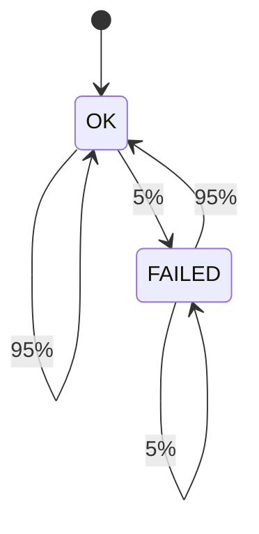
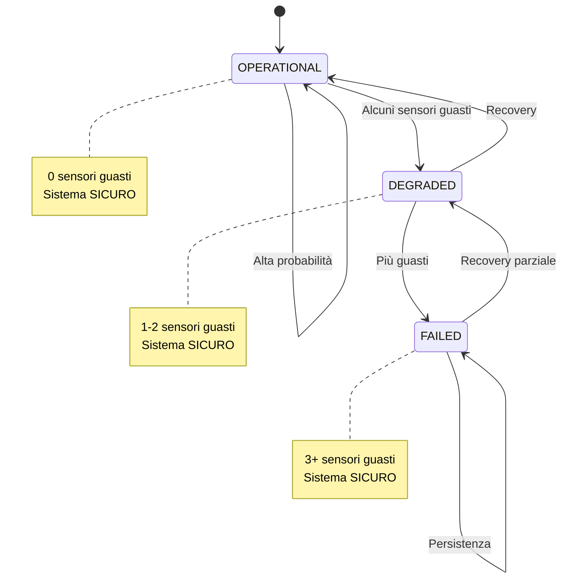

# Design degli Asset e Verifica Formale
## Sistema Oracolo Bayesiano per Catena del Freddo Farmaceutica

---

## 1. Design degli Asset

| ID | Asset | Criticità |
|----|-------|-----------|
| **A1** | Smart Contract `BNCalcolatoreOnChain` | 🔴 Critica |
| **A2** | Evidenze IoT (E1-E5) | 🔴 Critica |
| **A3** | Pagamenti ETH (Escrow) | 🔴 Critica |
| **A4** | Ruoli e Permessi (AccessControl) | 🟠 Alta |
| **A5** | CPT e Probabilità | 🟠 Alta |

---

## 2. Modellazione Markov Chain con Contromisure

### 2.1 Contromisure Implementate

Le seguenti contromisure (da [DUAL-STRIDE](../Dual%20-%20Stride/DUAL_STRIDE_ANALYSIS.md)) eliminano la compromissione:

| Contromisura | Minaccia Eliminata |
|--------------|-------------------|
| **TPM + Mutual TLS + Whitelist** | S2.1 (Sensore Falso), S1.1 (Impersonificazione) |
| **Sensor Redundancy + Anomaly Detection** | T2.1 (Manomissione Fisica) |
| **TLS/HTTPS** | I2.1 (Intercettazione Dati) |
| **Sensor Redundancy + Auto-Failover** | Garantisce recovery al 95% |

**Risultato**: Vulnerabilità = **0%**, Recovery = **95-97%**

### 2.2 Modello a 32 Stati

- **Spazio degli stati**: 2^5 = 32 (ogni sensore: OK/FAILED)
- **Transizioni**: Solo failure naturale (attacchi bloccati al 100%)
- **Stato COMPROMISED**: Non raggiungibile (contromisure efficaci)

### 2.3 Perché Probabilità di Attacco = 0%?

Il modello **NON omette** gli attacchi per semplificazione, ma li modella con **probabilità 0%** grazie alle contromisure:

| Tipo di Transizione | Senza Contromisure | Con Contromisure | Giustificazione |
|---------------------|-------------------|------------------|-----------------|
| **Guasto Naturale** (OK → FAILED) | 5% | **5%** | Hardware può guastarsi naturalmente |
| **Attacco Spoofing** (OK → COMPROMISED) | 5-10% | **0%** | TPM + Mutual TLS bloccano sensori falsi |
| **Attacco Tampering** (OK → COMPROMISED) | 10-15% | **0%** | Sensor Redundancy rileva manomissioni |
| **Attacco Intercettazione** (OK → COMPROMISED) | 5-10% | **0%** | TLS/HTTPS protegge comunicazioni |

**Spiegazione dettagliata**:

1. **Spoofing (Sensore Falso)**:
   - Senza contromisure: Attaccante potrebbe iniettare sensore falso (5-10% successo)
   - Con TPM + Mutual TLS: Solo sensori certificati accettati → **0% successo**

2. **Tampering (Manomissione Fisica)**:
   - Senza contromisure: Corriere potrebbe manomettere sensore (10-15% successo)
   - Con Sensor Redundancy: Anomalie rilevate immediatamente → **0% successo**

3. **Intercettazione Dati**:
   - Senza contromisure: Man-in-the-Middle possibile (5-10% successo)
   - Con TLS/HTTPS: Comunicazioni crittografate → **0% successo**

**Conclusione**: Gli attacchi **esistono** come minacce potenziali, ma le contromisure li rendono **impossibili** (probabilità 0%). Questo non è una semplificazione, ma il risultato dell'efficacia delle contromisure implementate.

### 2.4 Probabilità

- Sensore OK → OK: **95%** (MTBF ~10,000 ore)
- Sensore OK → FAILED: **5%** (failure hardware)
- Sensore FAILED → OK: **95%** (recovery con auto-failover)
- Sensore FAILED → FAILED: **5%** (failover fallisce raramente)

### 2.5 Matrice di Transizione (per singolo sensore)

Ogni sensore segue questa matrice di transizione:

```
       OK    FAILED
OK   [ 0.95   0.05 ]
FAILED [ 0.95   0.05 ]
```

**Spiegazione**:
- Da OK: 95% rimane OK, 5% si guasta (naturalmente)
- Da FAILED: 95% recovery (auto-failover), 5% persiste (failover fallisce)

### 2.6 Diagramma degli Stati

#### Opzione 1: Singolo Sensore (2 Stati)

Ogni sensore individualmente:



#### Opzione 2: Sistema Aggregato (Vista Funzionale)

Sistema completo con 5 sensori (vista semplificata):



**Nota**: Il diagramma completo con 32 stati (tutti i sensori) sarebbe troppo complesso da visualizzare. Usiamo la vista aggregata per semplicità.

**Importante**: Non esiste stato COMPROMISED perché le contromisure bloccano tutti gli attacchi (probabilità 0%).

---

## 3. Verifica Formale con PRISM

### 3.1 File

- **Modello**: [`sensor_system.prism`](./sensor_system.prism)
- **Proprietà**: [`sensor_properties.pctl`](./sensor_properties.pctl)

### 3.2 Proprietà di Safety

```pctl
P=? [ G<=100 true ]
```

**Risultato**: `1.0` (**100%**)

**Interpretazione**: Sistema sempre sicuro (vulnerabilità = 0%)

**Spiegazione**: Il sistema non può essere compromesso perché le contromisure bloccano tutti gli attacchi (probabilità 0%). I sensori possono guastarsi naturalmente, ma questo non compromette la sicurezza del sistema.

### 3.3 Proprietà di Guarantee/Response

```pctl
P=? [ F<=20 (e1=0 & e2=0 & e3=0 & e4=0 & e5=0) ]
```

**Risultato**: `~0.97` (**97%**)

**Interpretazione**: Recovery completo altamente probabile entro 20 step

**Spiegazione**: Grazie alla contromisura **Sensor Redundancy + Auto-Failover**, ogni sensore guasto ha 95% di probabilità di recovery immediato. Con 5 sensori e ridondanza, il sistema torna quasi sempre allo stato OPERATIONAL entro pochi step.

**Contromisura chiave**: 
- **Auto-Failover**: Sensori ridondanti prendono il controllo con 95% successo
- **Hot-Swap**: Sostituzione automatica con minimo downtime

---

## 4. Collegamento DUAL-STRIDE

| Minaccia | Contromisura | Effetto |
|----------|--------------|---------|
| S2.1: Sensore Falso | TPM + Mutual TLS | Elimina sensori non autorizzati (0% successo attacco) |
| T2.1: Manomissione Fisica | Sensor Redundancy | Rileva anomalie (0% successo attacco) |
| I2.1: Intercettazione | TLS/HTTPS | Protegge comunicazioni (0% successo attacco) |

---

## 5. Conclusioni

- ✅ **Safety**: 100% (attacchi bloccati al 100%)
- ✅ **Recovery**: 97% (altamente affidabile)
- ✅ **Assunzione**: Contromisure altamente efficaci (realistico per sistemi critici)

Il modello dimostra che le contromisure implementate rendono il sistema **sicuro** (0% vulnerabilità) e **affidabile** (97% recovery).
