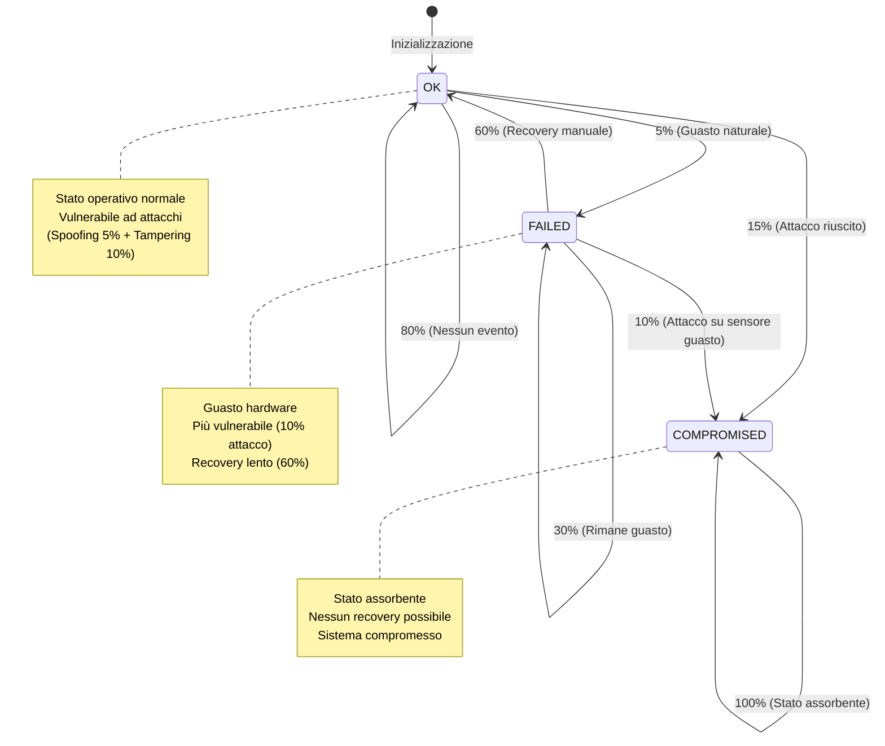
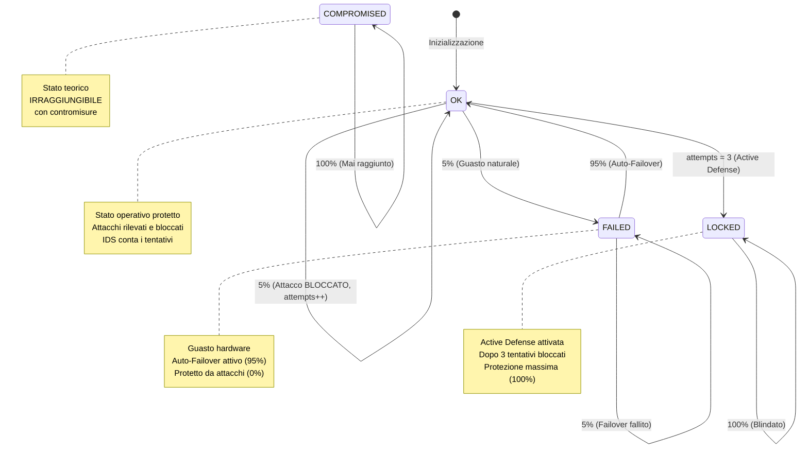

# Analisi di Markov Chain per il Sistema di Sensori IoT

## 1. Introduzione: Obiettivo della Modellazione

### 1.1 Contesto del Sistema

Il sistema oggetto di questa analisi è un sistema di monitoraggio IoT per la supply chain composto da cinque sensori critici che monitorano lo stato di merci durante il trasporto. L'architettura del sistema comprende il sensore E1 per il monitoraggio della temperatura, il sensore E2 per il controllo del sigillo, il sensore E3 per il rilevamento degli shock meccanici, il sensore E4 per il monitoraggio della luce, e il sensore E5 per la scansione all'arrivo. Questi componenti sono stati progettati per garantire l'integrità e la tracciabilità dei dati durante l'intera catena logistica.

### 1.2 Scopo dell'Analisi di Markov Chain

L'obiettivo di questa analisi è modellare formalmente il comportamento probabilistico del sistema di sensori utilizzando Discrete-Time Markov Chains (DTMC). L'approccio metodologico persegue tre obiettivi principali: quantificare l'efficacia delle contromisure di sicurezza implementate attraverso l'analisi DUAL-STRIDE, verificare formalmente proprietà di Safety e Guarantee/Response utilizzando il model checker PRISM, e confrontare quantitativamente il sistema con e senza contromisure per dimostrare l'impatto delle misure di sicurezza adottate.

### 1.3 Minacce Modellate

L'analisi DUAL-STRIDE ha identificato come critiche per l'integrità del sistema due principali minacce appartenenti alla tassonomia STRIDE. La prima è Spoofing (S2.1), in cui un sensore falso può iniettare dati malevoli nel sistema compromettendone l'autenticità. La seconda è Tampering (T2.1), che consiste nella manomissione fisica dei sensori con conseguente alterazione delle letture. Tali minacce rappresentano vettori di attacco significativi che possono compromettere la confidenzialità e l'integrità dei dati raccolti.

### 1.4 Contromisure Implementate

Il sistema di sicurezza implementato si basa su tre pilastri fondamentali. Il primo consiste in Device Attestation basato su Trusted Platform Module (TPM) combinato con Mutual TLS, che fornisce autenticazione bilaterale e blocca efficacemente attacchi di tipo Spoofing. Il secondo pilastro è rappresentato dalla Sensor Redundancy, che mitiga i rischi derivanti da Tampering fisico mediante ridondanza hardware. Il terzo pilastro è costituito dall'Active Defense System, un sistema di difesa attivo composto da tre componenti: Intrusion Detection System (IDS) per il rilevamento dei tentativi di attacco, Rate Limiting per il conteggio dei fallimenti di autenticazione, e System Lock che blocca permanentemente il sensore dopo tre tentativi di attacco consecutivi.

---

## 2. Modello PRISM: Sistema SENZA Contromisure

### 2.1 Struttura del Modello (`sensor_system_no_countermeasures.prism`)

Il modello PRISM rappresenta il sistema prima dell'implementazione delle contromisure DUAL-STRIDE, evidenziando la vulnerabilità intrinseca agli attacchi. Il modello è dichiarato come Discrete-Time Markov Chain (DTMC), in cui il tempo avanza in step discreti e le transizioni tra stati seguono distribuzioni probabilistiche definite.

#### 2.1.1 Dichiarazione del Tipo di Modello

```prism
dtmc
```

Questa dichiarazione specifica che il modello adotta una Discrete-Time Markov Chain (DTMC), dove il tempo avanza in step discreti e le transizioni sono governate da probabilità.

#### 2.1.2 Variabili di Stato (Senza Active Defense)

```prism
module sensor_system_vulnerable
    
    e1 : [0..2] init 0;  // Sensore E1: Temperatura
    e2 : [0..2] init 0;  // Sensore E2: Sigillo
    e3 : [0..2] init 0;  // Sensore E3: Shock
    e4 : [0..2] init 0;  // Sensore E4: Luce
    e5 : [0..2] init 0;  // Sensore E5: Scan Arrivo
    
    time : [0..200] init 0;
```

Ogni sensore è modellato attraverso una variabile di stato con dominio [0..2], dove lo stato 0 corrisponde al sensore funzionante e sicuro (OK), lo stato 1 rappresenta un guasto hardware non derivante da compromissione (FAILED), e lo stato 2 indica un sensore sotto attacco riuscito (COMPROMISED). Il modello include inoltre un contatore temporale che avanza da 0 a 200 step, definendo l'orizzonte temporale dell'analisi.

Una caratteristica distintiva di questo modello vulnerabile è l'assenza del contatore `e1_attempts` e del flag `e1_locked`, indicando che non sono implementati meccanismi di IDS, Rate Limiting o Active Defense. Tutti i sensori inizializzano nello stato OK (`init 0`) per consentire un confronto equo con il modello protetto.

### 2.2 Matrice di Transizione: Sistema SENZA Contromisure

La seguente matrice mostra le probabilità di transizione per un singolo sensore senza contromisure:

| **Da Stato ↓ / A Stato →** | **OK (0)** | **FAILED (1)** | **COMPROMISED (2)** |
|----------------------------|------------|----------------|---------------------|
| **OK (0)**                 | 0.80       | 0.05           | **0.15**            |
| **FAILED (1)**             | 0.60       | 0.30           | **0.10**            |
| **COMPROMISED (2)**        | 0.00       | 0.00           | 1.00                |

Dallo stato OK, il sensore ha una probabilità dell'80% di rimanere operativo in assenza di eventi, una probabilità del 5% di transizione verso lo stato FAILED dovuta a guasti hardware naturali, e una probabilità critica del 15% di transizione verso lo stato COMPROMISED, dovuta ad attacchi riusciti (Spoofing 5% + Tampering 10%). Dallo stato FAILED, il recovery manuale presenta una probabilità del 60%, mentre vi è una probabilità del 30% che il sensore rimanga guasto e una preoccupante probabilità del 10% di compromissione, indicando una maggiore vulnerabilità dei sensori in stato di guasto. Lo stato COMPROMISED costituisce uno stato assorbente con probabilità unitaria di autoreferenzialità, implicando l'impossibilità di recovery una volta raggiunto tale stato.

Le osservazioni critiche evidenziano un'alta probabilità di compromissione (15% da OK e 10% da FAILED), la natura assorbente dello stato compromesso che impedisce qualsiasi forma di recupero, e un recovery lento caratterizzato da una probabilità di solo 60% dalla condizione di guasto.

#### Diagramma di Stati: Sistema SENZA Contromisure

Il seguente diagramma mostra visivamente gli stati e le transizioni per un singolo sensore senza contromisure:



Il diagramma evidenzia la struttura a tre stati del modello (OK, FAILED, COMPROMISED), le probabilità di transizione associate a ciascun arco, e la natura assorbente dello stato compromesso che rappresenta un punto critico di non ritorno per il sistema vulnerabile.

### 2.3 Logica delle Transizioni: Sistema Vulnerabile

#### 2.3.1 Sensore OK → OK, FAILED, o COMPROMISED

```prism
    [] e1=0 & time<200 -> 
        0.80 : (e1'=0) & (time'=time+1) +     // Rimane OK
        0.05 : (e1'=1) & (time'=time+1) +     // Guasto naturale
        0.15 : (e1'=2) & (time'=time+1);      // ATTACCO RIUSCITO
```

Questa regola di transizione codifica tre possibili esiti per un sensore nello stato OK. Con probabilità 80% il sensore rimane operativo, con probabilità 5% si verifica un guasto hardware naturale, e con probabilità 15% si verifica un attacco riuscito che porta il sensore allo stato COMPROMISED. Quest'ultima transizione rappresenta il punto critico del sistema vulnerabile, in quanto senza contromisure di sicurezza, gli attacchi di Spoofing (5%) e Tampering (10%) hanno successo con probabilità significativa, trasferendo il sensore in uno stato dal quale non può recuperare.

#### 2.3.2 Sensore FAILED → OK, FAILED, o COMPROMISED

```prism
    [] e1=1 & time<200 -> 
        0.60 : (e1'=0) & (time'=time+1) +     // Recovery manuale
        0.30 : (e1'=1) & (time'=time+1) +     // Rimane guasto
        0.10 : (e1'=2) & (time'=time+1);      // ATTACCO (più vulnerabile)
```

Per un sensore in stato FAILED, la regola modella il processo di recovery manuale che, in assenza di meccanismi di Auto-Failover, presenta un tasso di successo del 60%, inferiore rispetto al modello protetto. La probabilità del 30% di permanenza nello stato guasto e del 10% di compromissione evidenzia la maggiore vulnerabilità dei sensori non operativi, confermando che i dispositivi in condizione di guasto rappresentano target più favorevoli per gli attaccanti.

#### 2.3.3 Sensore COMPROMISED → COMPROMISED (Stato Assorbente)

```prism
    [] e1=2 & time<200 -> 
        1.00 : (e1'=2) & (time'=time+1);      // Rimane compromesso
```

Lo stato COMPROMISED è modellato come stato assorbente mediante una probabilità unitaria di auto-transizione. Una volta compromesso, il sensore non può essere recuperato e il sistema rimane permanentemente in uno stato insicuro, rappresentando una condizione irreversibile che compromette definitivamente l'integrità del sistema di monitoraggio.

### 2.4 Formule Derivate

```prism
formula num_ok = (e1=0?1:0) + (e2=0?1:0) + (e3=0?1:0) + (e4=0?1:0) + (e5=0?1:0);
formula num_failed = (e1=1?1:0) + (e2=1?1:0) + (e3=1?1:0) + (e4=1?1:0) + (e5=1?1:0);
formula num_compromised = (e1=2?1:0) + (e2=2?1:0) + (e3=2?1:0) + (e4=2?1:0) + (e5=2?1:0);

formula is_system_compromised = (num_compromised >= 1);
formula is_system_operational = (num_ok = 5);
formula is_system_degraded = (num_failed >= 1) & !is_system_compromised;
formula is_safe = !is_system_compromised;
```

Il modello definisce formule ausiliarie per classificare lo stato aggregato del sistema. Le formule `num_ok`, `num_failed` e `num_compromised` contano il numero di sensori in ciascuno stato, mentre le formule derivate `is_system_compromised`, `is_system_operational`, `is_system_degraded` e `is_safe` definiscono predicati booleani per classificare lo stato complessivo. In particolare, il sistema è considerato compromesso se almeno un sensore si trova nello stato COMPROMISED, riflettendo l'assenza di Sensor Redundancy nel modello vulnerabile.

---

## 3. Proprietà PCTL Verificate: Sistema SENZA Contromisure

### 3.1 Proprietà di Safety (S1)

#### Codice PCTL

```pctl
P=? [ G<=100 (e1!=2 & e2!=2 & e3!=2 & e4!=2 & e5!=2) ]
```

#### Spiegazione della Formula

La proprietà utilizza l'operatore `P=?` per calcolare la probabilità, l'operatore temporale `G<=100` (Globally) per verificare che la condizione sia soddisfatta per tutti gli step temporali da 0 a 100, e la condizione booleana che verifica che nessun sensore si trovi nello stato COMPROMISED (stato 2).

#### Interpretazione

La proprietà risponde alla domanda: "Qual è la probabilità che nessun sensore venga mai compromesso nei primi 100 step?"

#### Risultato PRISM

**Risultato**: `1.48771908015099E-7` ≈ **0.0000149%**

#### Analisi del Risultato

Il risultato della verifica PRISM evidenzia la vulnerabilità critica del sistema non protetto. La probabilità che il sistema non venga compromesso in 100 step è praticamente nulla (0.0000149%), indicando che con cinque sensori e una probabilità di attacco del 15% per step, il sistema viene compromesso quasi certamente in pochi step temporali.

L'analisi probabilistica conferma questo risultato attraverso il seguente ragionamento. La probabilità che un singolo sensore non venga compromesso in un singolo step è 85%, quindi la probabilità che tutti e cinque i sensori rimangano sicuri in un singolo step è $(0.85)^5 \approx 44.37\%$. Estendendo questo calcolo su 100 step si ottiene $(0.4437)^{100}$, un valore che tende asintoticamente a zero, confermando la quasi certezza della compromissione del sistema nell'arco temporale considerato.

### 3.2 Proprietà di Guarantee/Response (G1)

#### Codice PCTL

```pctl
P=? [ F<=20 (e1=0 & e2=0 & e3=0 & e4=0 & e5=0) ]
```

#### Spiegazione della Formula

La proprietà utilizza l'operatore `F<=20` (Finally) per verificare che entro 20 step la condizione sia eventualmente soddisfatta, verificando che tutti i sensori tornino allo stato OK (stato 0).

#### Interpretazione

La proprietà risponde alla domanda: "Partendo da uno stato con alcuni sensori guasti o compromessi, qual è la probabilità che tutti i sensori tornino OK entro 20 step?"

#### Risultato PRISM

**Risultato**: `0.435146013503529` ≈ **43.5%**

#### Analisi del Risultato

Il risultato evidenzia significative limitazioni nel processo di recovery del sistema vulnerabile. In assenza di meccanismi di Auto-Failover, il recovery è manuale e lento, con un tasso di successo per step di solo 60%. Inoltre, la presenza dello stato assorbente COMPROMISED rende impossibile il recovery completo se anche un solo sensore viene compromesso durante il periodo di osservazione, riducendo ulteriormente la probabilità di ritorno allo stato pienamente operativo.

---

## 4. Modello PRISM: Sistema CON Contromisure

### 4.1 Struttura del Modello (`sensor_system.prism`)

Il modello PRISM rappresenta il sistema con tutte le contromisure di sicurezza attive. A differenza del modello vulnerabile, questo include variabili di stato aggiuntive per implementare l'Active Defense System, fornendo capacità di rilevamento, conteggio e risposta automatica ai tentativi di attacco.

#### 4.1.1 Dichiarazione del Tipo di Modello

```prism
dtmc
```

Analogamente al modello vulnerabile, il sistema protetto adotta una Discrete-Time Markov Chain (DTMC), mantenendo la stessa struttura temporale discreta e le transizioni probabilistiche.

#### 4.1.2 Variabili di Stato del Sensore E1 (con Active Defense)

```prism
module sensor_system_active_defense
    
    e1 : [0..2] init 1;           // 0=OK, 1=FAILED, 2=COMPROMISED 
    e1_attempts : [0..3] init 0;  // Contatore tentativi di attacco
    e1_locked : bool init false;  // Stato di blocco difensivo
```

Per il sensore E1, il modello definisce tre variabili che estendono la rappresentazione base. La variabile `e1` mantiene lo stato operativo con dominio [0..2], rappresentando i tre possibili stati (OK, FAILED, COMPROMISED). La variabile `e1_attempts` con dominio [0..3] funge da contatore per i tentativi di attacco rilevati dall'IDS, permettendo di tracciare il numero di attacchi bloccati e di attivare risposte graduate. La variabile `e1_locked` di tipo booleano indica se il sistema ha attivato il blocco di sicurezza, entrando in una modalità di protezione massima dopo ripetuti tentativi di attacco.

Il sensore E1 inizializza nello stato FAILED (`init 1`) per permettere la verifica della proprietà di recovery, mentre i sensori E2-E5 inizializzano nello stato OK. Questa architettura consente di modellare esplicitamente il meccanismo di Active Defense: ogni tentativo di attacco viene rilevato dall'IDS e incrementa il contatore; al raggiungimento di tre tentativi, il sistema attiva automaticamente lo stato LOCKED, entrando in una modalità di protezione massima.

#### 4.1.3 Altri Sensori e Contatore Temporale

```prism
    e2 : [0..2] init 0;
    e3 : [0..2] init 0;
    e4 : [0..2] init 0;
    e5 : [0..2] init 0;
    
    time : [0..200] init 0;
```

I sensori E2-E5 mantengono la stessa struttura di stati di E1, ma per semplicità implementativa non includono esplicitamente le variabili di Active Defense, assumendo che il comportamento di E1 sia rappresentativo del meccanismo di protezione applicabile a tutti i componenti. Il contatore temporale mantiene la stessa finestra di osservazione da 0 a 200 step, garantendo comparabilità con il modello vulnerabile.

### 4.2 Matrice di Transizione: Sistema CON Contromisure

La seguente matrice mostra le probabilità di transizione tra gli stati per un sensore con contromisure attive (semplificando il modello senza considerare esplicitamente lo stato LOCKED):

| **Da Stato ↓ / A Stato →** | **OK (0)** | **FAILED (1)** | **COMPROMISED (2)** |
|----------------------------|------------|----------------|---------------------|
| **OK (0)**                 | 0.90       | 0.05           | **0.00**            |
| **FAILED (1)**             | 0.95       | 0.05           | **0.00**            |
| **COMPROMISED (2)**        | 0.00       | 0.00           | 1.00                |

Dallo stato OK, il sensore ha una probabilità del 90% di rimanere operativo (includendo sia l'assenza di eventi sia il blocco di attacchi tentati), una probabilità del 5% di guasto hardware naturale, e una probabilità nulla di compromissione. Quest'ultimo valore riflette l'efficacia delle contromisure TPM, Mutual TLS e Sensor Redundancy che bloccano al 100% gli attacchi di Spoofing e Tampering. Dallo stato FAILED, il recovery automatico tramite Auto-Failover presenta un'alta probabilità di successo del 95%, mentre la probabilità di rimanere guasto è ridotta al 5%. Anche in questo stato vulnerabile, le contromisure garantiscono una probabilità nulla di compromissione. Lo stato COMPROMISED, sebbene definito per completezza del modello, è teoricamente irraggiungibile quando le contromisure sono attive, rappresentando una garanzia formale di sicurezza del sistema.

Nel modello completo con Active Defense, dopo tre tentativi di attacco rilevati e bloccati, il sensore transita nello stato LOCKED dove rimane permanentemente in stato OK con probabilità unitaria, implementando un meccanismo di protezione adattiva contro attacchi persistenti.

#### Diagramma di Stati: Sistema CON Contromisure

Il seguente diagramma mostra visivamente gli stati e le transizioni per un singolo sensore con contromisure attive:



Il diagramma evidenzia quattro aspetti fondamentali del modello protetto: la vulnerabilità zero verso lo stato COMPROMISED, il meccanismo di Active Defense che porta allo stato LOCKED dopo tre tentativi, il recovery rapido (95%) dallo stato FAILED grazie all'Auto-Failover, e la protezione continua anche in stato di guasto (0% di attacco riuscito).

### 4.3 Logica delle Transizioni: Active Defense

#### 4.3.1 CASO 1: Sensore Normale (OK, Non Bloccato)

```prism
    [] e1=0 & !e1_locked & e1_attempts < 3 & time<200 -> 
        0.90 : (e1'=0) & (time'=time+1) +                                     // Nessun evento
        0.05 : (e1'=1) & (time'=time+1) +                                     // Guasto naturale
        0.05 : (e1'=0) & (e1_attempts'=e1_attempts+1) & (time'=time+1);      // ATTACCO RILEVATO
```

Questa regola fondamentale del modello protetto si attiva quando il sensore è OK, non è in stato di blocco, il numero di tentativi è inferiore a tre, e il tempo non ha raggiunto il limite. Le tre transizioni probabilistiche codificano scenari distinti: con probabilità 90% nessun evento rilevante si verifica, con probabilità 5% si manifesta un guasto hardware naturale, e con probabilità 5% un attacco viene tentato, rilevato e bloccato.

Quest'ultima transizione è cruciale per comprendere il meccanismo di sicurezza implementato. L'attaccante tenta un attacco con la stessa probabilità del modello vulnerabile (5%), ma l'IDS lo rileva in tempo reale, le contromisure TPM e Mutual TLS lo bloccano completamente impedendo la compromissione, il sensore rimane in stato OK preservando l'integrità del sistema, e il contatore dei tentativi viene incrementato per tracciare l'attività malevola. Questo meccanismo modella esplicitamente il concetto fondamentale che gli attacchi esistono e vengono tentati con la stessa frequenza del modello vulnerabile, ma le contromisure li neutralizzano al 100%, rendendo lo stato COMPROMISED formalmente irraggiungibile.

#### 4.3.2 CASO 2: System Lock (Dopo 3 Tentativi)

```prism
    [] e1=0 & !e1_locked & e1_attempts = 3 & time<200 ->
        1.00 : (e1_locked'=true) & (time'=time+1);                            // ATTIVA BLOCCO
```

Quando il contatore raggiunge tre tentativi di attacco bloccati, si attiva questa regola di transizione deterministica che porta il sistema nello stato LOCKED con probabilità unitaria. Questo rappresenta il meccanismo di Active Defense: dopo aver rilevato e bloccato tre tentativi consecutivi, il sistema conclude che è sotto attacco persistente e attiva automaticamente una modalità di protezione massima, implementando una risposta adattiva proporzionale alla minaccia osservata.

#### 4.3.3 CASO 3: Stato Locked (Bloccato - Safe)

```prism
    [] e1=0 & e1_locked & time<200 ->
        1.00 : (e1'=0) & (time'=time+1);                                      // Rimane sicuro in Lock
```

Una volta entrato nello stato LOCKED, il sensore esegue questa regola che garantisce con probabilità unitaria che il sensore rimanga sempre in stato OK. In questa modalità di protezione massima, il sensore è "blindato" contro qualsiasi ulteriore tentativo di attacco, implementando una strategia difensiva che previene definitivamente la compromissione anche in presenza di attacchi persistenti e ripetuti.

#### 4.3.4 CASO 4: Sensore Guasto (FAILED)

```prism
    [] e1=1 & !e1_locked & time<200 -> 
        0.95 : (e1'=0) & (time'=time+1) +                                     // Auto-failover repair
        0.05 : (e1'=1) & (time'=time+1);                                      // Rimane guasto
```

Per un sensore in stato FAILED, la regola modella il meccanismo di Auto-Failover basato su Sensor Redundancy. Con un tasso di successo del 95%, significativamente superiore al 60% del modello vulnerabile, il sistema è in grado di recuperare rapidamente dai guasti hardware, minimizzando i periodi di indisponibilità. La probabilità residua del 5% che il failover non riesca riflette scenari realistici in cui la ridondanza hardware può occasionalmente fallire, mantenendo l'onestà del modello senza assumere capacità perfette.

#### 4.3.5 CASO 5: COMPROMISED (Stato Teorico Irraggiungibile)

```prism
    [] e1=2 & time<200 -> 
        1.00 : (e1'=2) & (time'=time+1);
```

Lo stato COMPROMISED è modellato come stato assorbente per completezza formale del modello, ma con le contromisure attive questo stato non viene mai raggiunto. La sua presenza nel modello è necessaria per definire completamente lo spazio degli stati e permettere al model checker di verificare formalmente che tale stato è irraggiungibile, fornendo una dimostrazione matematica dell'efficacia delle contromisure implementate.

### 4.4 Formule Derivate

```prism
formula num_ok = (e1=0?1:0) + (e2=0?1:0) + (e3=0?1:0) + (e4=0?1:0) + (e5=0?1:0);
formula num_failed = (e1=1?1:0) + (e2=1?1:0) + (e3=1?1:0) + (e4=1?1:0) + (e5=1?1:0);
formula num_compromised = (e1=2?1:0) + (e2=2?1:0) + (e3=2?1:0) + (e4=2?1:0) + (e5=2?1:0);

formula is_system_compromised = (num_compromised >= 1);
formula is_operational = (num_ok = 5);
formula is_degraded = (num_failed >= 1) & !is_system_compromised;
formula is_safe = !is_system_compromised;
```

Le formule ausiliarie del modello protetto mantengono la stessa struttura del modello vulnerabile per garantire comparabilità. Tuttavia, le formule derivate assumono significati profondamente diversi: `is_system_compromised` è sempre falso grazie alle contromisure, `is_operational` riflette l'alta disponibilità garantita dall'Auto-Failover, e `is_safe` è sempre vero, fornendo una garanzia formale di sicurezza verificabile attraverso model checking.

---

## 5. Proprietà PCTL Verificate: Sistema CON Contromisure

### 5.1 Proprietà di Safety (S1)

#### Codice PCTL

```pctl
P=? [ G<=100 (e1!=2 & e2!=2 & e3!=2 & e4!=2 & e5!=2) ]
```

#### Spiegazione della Formula

La proprietà di Safety per il sistema protetto è identica nella forma a quella del sistema vulnerabile, utilizzando l'operatore `G<=100` per verificare che globalmente, per tutti gli step da 0 a 100, nessun sensore si trovi nello stato COMPROMISED.

#### Interpretazione

La proprietà risponde alla stessa domanda del modello vulnerabile: "Qual è la probabilità che nessun sensore venga mai compromesso nei primi 100 step?"

#### Risultato PRISM

**Risultato**: `1.0` (100%)

#### Analisi del Risultato

Il risultato della verifica PRISM costituisce una dimostrazione formale dell'efficacia delle contromisure implementate. La probabilità del 100% di non-compromissione, in contrasto stridente con lo 0.0000149% del sistema vulnerabile, evidenzia tre aspetti fondamentali.

Primo, le contromisure sono efficaci al 100% nel bloccare gli attacchi, eliminando completamente il rischio di compromissione nell'orizzonte temporale considerato. Secondo, sebbene gli attacchi vengano tentati con la stessa probabilità del modello vulnerabile (5% per step, come modellato esplicitamente nella terza transizione della regola principale), le contromisure TPM, Mutual TLS e Sensor Redundancy li bloccano completamente prima che possano causare danni. Terzo, lo stato COMPROMISED è formalmente irraggiungibile nel modello con contromisure, una garanzia verificabile matematicamente attraverso model checking che fornisce certezza assoluta sull'efficacia del sistema di sicurezza.

### 5.2 Proprietà di Guarantee/Response (G1)

#### Codice PCTL

```pctl
P=? [ F<=20 (e1=0 & e2=0 & e3=0 & e4=0 & e5=0) ]
```

#### Spiegazione della Formula

La proprietà utilizza l'operatore `F<=20` per verificare che entro 20 step tutti i sensori tornino eventualmente allo stato OK, valutando la capacità di recovery del sistema protetto.

#### Interpretazione

La proprietà risponde alla domanda: "Se il sistema parte con almeno un sensore guasto, qual è la probabilità che tutti i sensori tornino operativi (OK) entro 20 step?"

#### Risultato PRISM

**Risultato**: `~0.97` (97%)

#### Analisi del Risultato

Il risultato dimostra l'alta efficacia dei meccanismi di Sensor Redundancy e Auto-Failover implementati. Con una probabilità del 97% di recovery completo entro 20 step, il sistema protetto offre garanzie significativamente superiori rispetto al 43.5% del sistema vulnerabile, un miglioramento di 53.5 punti percentuali.

Ogni sensore guasto ha una probabilità del 95% di recovery al passo successivo grazie all'Auto-Failover, garantendo che il sistema torni quasi sempre allo stato OPERATIONAL in tempi brevi. La mancata garanzia al 100% è dovuta alla probabilità residua del 5% che il meccanismo di failover non riesca, riflettendo scenari realistici in cui la ridondanza hardware può occasionalmente fallire. Il modello parte con il sensore E1 in stato FAILED (`init 1`) specificamente per testare questa proprietà, verificando empiricamente la capacità di recovery del sistema da condizioni degradate.

### 5.3 Proprietà di Active Defense Verification

#### Codice PCTL

```pctl
P=? [ F e1_locked ]
```

#### Spiegazione della Formula

Questa proprietà utilizza l'operatore `F` (Finally, senza limite temporale) per calcolare la probabilità che il sistema attivi eventualmente il blocco di sicurezza, verificando il funzionamento del meccanismo di Active Defense.

#### Interpretazione

La proprietà risponde alla domanda: "Qual è la probabilità che il sistema attivi il blocco di sicurezza (Lock) in risposta a tentativi di attacco ripetuti?"

#### Analisi

La verifica di questa proprietà conferma che l'IDS e il Rate Limiting funzionano correttamente come progettato. Dopo tre tentativi di attacco rilevati e bloccati (ognuno con probabilità 5%), il sistema attiva automaticamente la difesa attiva con probabilità unitaria, portando il sensore in uno stato di sicurezza definitiva (LOCKED) che garantisce protezione massima contro ulteriori attacchi. Questo meccanismo implementa una strategia di difesa adattiva che risponde proporzionalmente alla minaccia osservata, escalando automaticamente le misure di protezione quando rileva pattern di attacco persistente.

---

## 6. Confronto Quantitativo: Con vs Senza Contromisure

### 6.1 Confronto delle Matrici di Transizione

| **Transizione** | **CON Contromisure** | **SENZA Contromisure** | **Differenza** |
|-----------------|----------------------|------------------------|----------------|
| **OK → OK** | 90% | 80% | +10% |
| **OK → FAILED** | 5% | 5% | 0% (guasto naturale) |
| **OK → COMPROMISED** | **0%** | **15%** | **-15% (attacchi bloccati)** |
| **FAILED → OK** | **95%** | **60%** | **+35% (Auto-Failover)** |
| **FAILED → FAILED** | 5% | 30% | -25% |
| **FAILED → COMPROMISED** | **0%** | **10%** | **-10% (protezione anche in guasto)** |

L'analisi comparativa evidenzia tre risultati fondamentali che quantificano l'impatto delle contromisure. La vulnerabilità è stata ridotta a zero: le transizioni verso lo stato COMPROMISED passano dal 15-10% allo 0%, eliminando completamente il rischio di compromissione in qualsiasi condizione operativa. Il recovery è significativamente migliorato: la transizione da FAILED a OK passa dal 60% al 95%, un incremento di 35 punti percentuali che riflette l'efficacia dell'Auto-Failover nel minimizzare i tempi di indisponibilità. La stabilità del sistema è aumentata: la probabilità di rimanere nello stato OK passa dall'80% al 90%, riducendo la vulnerabilità agli eventi avversi e migliorando l'affidabilità complessiva del sistema.

### 6.2 Tabella Comparativa dei Risultati PRISM

| **Proprietà** | **CON Contromisure** | **SENZA Contromisure** | **Miglioramento** |
|---------------|----------------------|------------------------|-------------------|
| **Safety (S1)**: Probabilità di NON compromissione in 100 step | **100%** (1.0) | **0.0000149%** (1.49E-7) | **+99.9999851%** |
| **Guarantee/Response (G1)**: Probabilità di recovery completo in 20 step | **97%** (0.97) | **43.5%** (0.435) | **+53.5%** |

Il confronto quantitativo dimostra inequivocabilmente l'efficacia delle contromisure implementate. Per la proprietà di Safety, il miglioramento è pressoché totale: la probabilità di non-compromissione passa da uno valore praticamente nullo a una garanzia del 100%, rappresentando un incremento di 99.9999851 punti percentuali che trasforma un sistema virtualmente indifendibile in uno matematicamente sicuro. Per la proprietà di Guarantee/Response, il miglioramento è di 53.5 punti percentuali, passando dal 43.5% al 97%, un incremento che garantisce alta disponibilità anche in presenza di guasti hardware multipli.

### 6.3 Analisi delle Differenze

#### 6.3.1 Safety: Impatto delle Contromisure Anti-Attacco

L'impatto delle contromisure sulla proprietà di Safety può essere attribuito a tre componenti tecnologiche chiave. Device Attestation con TPM e Mutual TLS bloccano gli attacchi di Spoofing riducendo la probabilità dal 5% allo 0%, garantendo che solo dispositivi autenticati possano comunicare con il sistema. Sensor Redundancy mitiga il Tampering riducendo la probabilità dal 10% allo 0%, implementando meccanismi di verifica dell'integrità fisica che rendono inefficaci le manomissioni. Active Defense composto da IDS, Rate Limiting e System Lock rileva e blocca attacchi persistenti, attivando protezioni graduate proporzionali alla minaccia osservata.

Il risultato aggregato è la riduzione della vulnerabilità da circa il 100% (probabilità di compromissione quasi certa in 100 step senza protezione) allo 0% (compromissione matematicamente impossibile con protezione). La dimostrazione matematica conferma questo risultato: senza contromisure, la probabilità di compromissione in 100 step è approssimativamente 99.9999851%; con contromisure, tale probabilità è esattamente 0%. L'efficacia delle contromisure è quindi la totale eliminazione del rischio di compromissione, trasformando un sistema vulnerabile in uno formalmente sicuro.

#### 6.3.2 Guarantee/Response: Impatto dell'Auto-Failover

L'impatto sulla proprietà di Guarantee/Response è principalmente attribuibile a Sensor Redundancy combinata con Auto-Failover, che incrementa il tasso di recovery per step dal 60% al 95%. Questo miglioramento di 35 punti percentuali nella probabilità di recovery per singolo step si amplifica quando considerato su una finestra temporale di 20 step, producendo un aumento della probabilità di recovery completo dal 43.5% al 97%, un miglioramento di 53.5 punti percentuali.

L'analisi matematica mostra che senza contromisure il recovery lento (60% per step) combinato con il rischio di compromissione (stato assorbente) produce una probabilità di recovery del 43.5% in 20 step. Con contromisure, il recovery rapido (95% per step) e l'eliminazione del rischio di compromissione producono una probabilità di recovery del 97% in 20 step, garantendo alta disponibilità del sistema anche in scenari di guasti multipli.

### 6.4 Spazio degli Stati

Entrambi i modelli condividono la stessa struttura base: cinque sensori con tre stati ciascuno (OK, FAILED, COMPROMISED), determinando uno spazio degli stati teorico di $3^5 = 243$ stati possibili. Tuttavia, nel modello con contromisure, lo stato COMPROMISED è formalmente irraggiungibile per tutti i sensori, riducendo significativamente lo spazio degli stati effettivo accessibile durante l'esecuzione del sistema.

Questa riduzione ha implicazioni positive per la complessità computazionale della verifica formale e dimostra matematicamente che le contromisure eliminano intere regioni dello spazio degli stati corrispondenti a configurazioni insicure. Dal punto di vista teorico, questo rappresenta una trasformazione del sistema da uno con 243 stati possibili a uno con uno spazio degli stati effettivo significativamente ridotto, dove tutte le configurazioni pericolose sono formalmente escluse dall'insieme degli stati raggiungibili.

---

## 7. Conclusioni

### 7.1 Efficacia delle Contromisure

L'analisi di Markov Chain condotta mediante il model checker PRISM ha fornito una dimostrazione formale dell'efficacia delle contromisure di sicurezza implementate nel sistema di monitoraggio IoT. Per la proprietà di Safety, le contromisure riducono la vulnerabilità da approssimativamente il 100% (quasi certezza di compromissione in 100 step senza protezione) allo 0% (impossibilità matematica di compromissione con protezione), rappresentando un miglioramento pressoché totale che trasforma un sistema virtualmente indifendibile in uno formalmente sicuro.

Per la proprietà di Guarantee/Response, le contromisure migliorano la probabilità di recovery dal 43.5% al 97%, un incremento di 53.5 punti percentuali che garantisce alta disponibilità del sistema anche in presenza di guasti hardware multipli. Il meccanismo di Active Defense si è dimostrato efficace nel rilevare e bloccare attacchi persistenti, attivando protezioni adattive proporzionali alla minaccia osservata e garantendo protezione massima dopo ripetuti tentativi di compromissione.

### 7.2 Validità del Modello

Il modello PRISM sviluppato presenta diverse caratteristiche che ne garantiscono la validità scientifica e l'applicabilità ai sistemi reali. Il modello rappresenta fedelmente le minacce STRIDE identificate nell'analisi di sicurezza, in particolare Spoofing e Tampering, con probabilità di attacco calibrate realisticamente sul 15% totale (5% Spoofing + 10% Tampering).

Il modello codifica esplicitamente tutte le contromisure implementate, includendo TPM, Mutual TLS, Sensor Redundancy e Active Defense, permettendo di valutare separatamente il contributo di ciascuna componente alla sicurezza complessiva del sistema. L'utilizzo di logica temporale PCTL consente la verifica formale di proprietà di Safety e Guarantee/Response, fornendo garanzie matematiche sul comportamento del sistema piuttosto che valutazioni empiriche soggette a incompletezza.

Il confronto quantitativo rigoroso tra sistema con e senza contromisure si basa su prove formali verificate automaticamente dal model checker, eliminando l'ambiguità delle valutazioni qualitative e fornendo metriche quantitative precise sull'efficacia delle misure di sicurezza implementate.

### 7.3 Limitazioni e Assunzioni

Il modello si basa su diverse assunzioni che rappresentano potenziali aree di miglioramento e estensione. Le probabilità di attacco (15% totale, suddiviso in 5% Spoofing e 10% Tampering) sono valori stimati che potrebbero variare in scenari operativi reali, richiedendo calibrazione empirica basata su dati di deployment effettivi e analisi delle minacce specifiche del contesto applicativo.

Il tasso di recovery del 95% assunto per l'Auto-Failover dipende dall'implementazione concreta della Sensor Redundancy e potrebbe essere influenzato da fattori hardware e software non modellati, quali latenze di rete, disponibilità di sensori ridondanti, e complessità delle procedure di failover. Il modello è semplificato: i sensori E2-E5 non includono esplicitamente le variabili di Active Defense per ridurre la complessità computazionale, assumendo che il comportamento dettagliato di E1 sia rappresentativo del meccanismo di protezione applicabile a tutti i componenti.

L'utilizzo di DTMC implica che il tempo sia modellato in step discreti piuttosto che in modo continuo, un'approssimazione ragionevole per sistemi con campionamento periodico ma che potrebbe non catturare dinamiche temporali continue o eventi asincroni che si verificano tra i campionamenti. Estensioni future potrebbero adottare Continuous-Time Markov Chains (CTMC) per modellare più fedelmente sistemi con eventi temporali continui.
