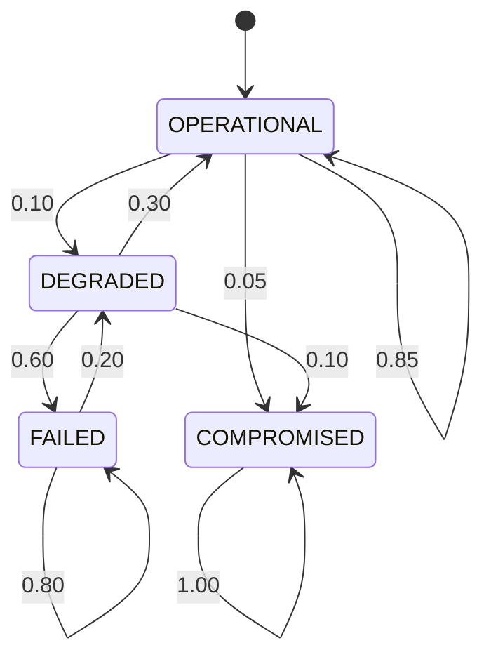

# Design degli Asset e Verifica Formale
## Sistema Oracolo Bayesiano per Catena del Freddo Farmaceutica
---

## 1. Design degli Asset

### 1.1 Asset Critici del Sistema

| ID | Asset | Descrizione | Criticità |
|----|-------|-------------|-----------|
| **A1** | Smart Contract `BNCalcolatoreOnChain` | Contratto Solidity che gestisce logica di business | 🔴 Critica |
| **A2** | Evidenze IoT (E1-E5) | Dati dai sensori IoT | 🔴 Critica |
| **A3** | Pagamenti ETH (Escrow) | Fondi bloccati nel contratto | 🔴 Critica |
| **A4** | Ruoli e Permessi (AccessControl) | Sistema di autorizzazione | 🟠 Alta |
| **A5** | CPT e Probabilità | Parametri della Bayesian Network | 🟠 Alta |
| **A6** | Dati Spedizioni On-Chain | Record delle spedizioni | 🟡 Media |
| **A7** | Interfaccia Web | Frontend per interazione utente | 🟡 Media |
| **A8** | Chiavi Private MetaMask | Credenziali utenti | 🔴 Critica |
----

## 2. Modellazione Markov Chain

### 2.1 Unità Modellata: Sistema Sensori IoT

Il sistema di sensori IoT è critico perché le evidenze E1-E5 determinano se il pagamento viene eseguito. I sensori sono vulnerabili a guasti hardware e attacchi informatici.

### 2.2 Stati del Sistema

| Stato | Descrizione |
|-------|-------------|
| **OPERATIONAL** | Tutti i 5 sensori funzionanti |
| **DEGRADED** | 3-4 sensori funzionanti |
| **FAILED** | 0-2 sensori funzionanti |
| **COMPROMISED** | ≥1 sensore compromesso (STATO ASSORBENTE) |

### 2.3 Diagramma degli Stati



### 2.4 Matrice di Transizione

```
P = | 0.85  0.10  0.00  0.05 |
    | 0.30  0.00  0.60  0.10 |
    | 0.00  0.20  0.80  0.00 |
    | 0.00  0.00  0.00  1.00 |
```

**Giustificazione Probabilità**:
- **OPERATIONAL → OPERATIONAL (0.85)**: MTBF sensori IoT industriali ~10,000 ore (IEC 61508)
- **OPERATIONAL → DEGRADED (0.10)**: Guasto hardware naturale (degrado batterie, interferenze)
- **OPERATIONAL → COMPROMISED (0.05)**: ~5% dispositivi IoT compromessi annualmente (Kaspersky IoT Report 2023)
- **DEGRADED → OPERATIONAL (0.30)**: Recovery tramite manutenzione/riparazione
- **DEGRADED → FAILED (0.60)**: Sistema degradato tende a peggiorare senza intervento
- **DEGRADED → COMPROMISED (0.10)**: Sistemi degradati più vulnerabili ad attacchi (OWASP IoT Top 10)
- **FAILED → DEGRADED (0.20)**: Sostituzione parziale sensori
- **FAILED → FAILED (0.80)**: Persistenza failure senza manutenzione
- **COMPROMISED → COMPROMISED (1.00)**: Stato assorbente (richiede intervento manuale completo)

**Nota**: Le probabilità rappresentano scenario worst-case senza contromisure implementate.

### 2.5 Mappatura Stati Markov → STRIDE-DUAL

Il modello a catena di Markov formalizza le minacce identificate nell'analisi DUAL-STRIDE, concentrandosi su **Unreliability (U)** e **Danger (D+)** per l'asset **A2: Evidenze IoT**.

| Stato Markov | Categoria STRIDE-DUAL | Minaccia Corrispondente | Tipo Attore |
|--------------|----------------------|-------------------------|-------------|
| **OPERATIONAL** | - | Nessuna minaccia attiva | - |
| **DEGRADED** | **U** (Unreliability) | [U1.1: Failure Sensore IoT](../Dual%20-%20Stride/DUAL_STRIDE_ANALYSIS.md#minaccia-u11-failure-sensore-iot) | Utente Maldestro / Hardware |
| **FAILED** | **D** (Denial of Service) | [D1.2: Blocco Spedizioni](../Dual%20-%20Stride/DUAL_STRIDE_ANALYSIS.md#minaccia-d12-blocco-spedizioni-evidenze-mancanti) | Utente Maldestro / Hardware |
| **COMPROMISED** | **S+T** (Spoofing + Tampering) | [S2.1: Sensore Falso](../Dual%20-%20Stride/DUAL_STRIDE_ANALYSIS.md#minaccia-s21-sensore-falso) + [T2.1: Manomissione Fisica](../Dual%20-%20Stride/DUAL_STRIDE_ANALYSIS.md#minaccia-t21-manomissione-fisica-sensore) | Attaccante Intenzionale |

#### Giustificazione Probabilità con Riferimenti DUAL-STRIDE

**Transizioni da Failure Naturale (Unreliability)**:
- **OPERATIONAL → DEGRADED (0.10)**: Minaccia **U1.1** - Guasto hardware naturale (MTBF sensori IoT industriali ~10,000 ore, IEC 61508)
- **DEGRADED → FAILED (0.60)**: Minaccia **U1.1** - Sistema degradato tende a peggiorare senza intervento (cascading failures)
- **FAILED → DEGRADED (0.20)**: Recovery parziale tramite manutenzione/sostituzione sensori

**Transizioni da Attacco (Spoofing + Tampering)**:
- **OPERATIONAL → COMPROMISED (0.05)**: Minacce **S2.1 + T2.1** - ~5% dispositivi IoT compromessi annualmente (Kaspersky IoT Report 2023)
- **DEGRADED → COMPROMISED (0.10)**: Minaccia **D+1.1** - Sistemi degradati sono più vulnerabili ad attacchi (OWASP IoT Top 10, superficie di attacco aumentata)

**Stato Assorbente (Safety-Critical)**:
- **COMPROMISED → COMPROMISED (1.00)**: Minaccia **D+1.1: Deterioramento Prodotto** - Stato assorbente che richiede intervento manuale completo per garantire safety

#### Approccio DUAL

Il modello include entrambe le prospettive dell'analisi DUAL:

1. **Utenti Maldestri / Failure Hardware**: OPERATIONAL → DEGRADED → FAILED (guasti naturali, batterie scariche, interferenze)
2. **Attaccanti Intenzionali**: OPERATIONAL → COMPROMISED (attacchi informatici, manomissione fisica sensori)

---

## 3. Verifica Formale con PRISM

### 3.1 Modello PRISM

**File**: [`sensor_system.prism`](./sensor_system.prism)

### 3.2 Proprietà Verificate

**File**: [`sensor_properties.pctl`](./sensor_properties.pctl)

#### Proprietà di Safety (S1)

```
P=? [ G<=100 state!=3 ]
```

**Significato**: Qual è la probabilità che il sistema rimanga sicuro (non compromesso) per 100 step?

**Risultato PRISM**: `0.03171339085361115` (**3.17%**)

**Interpretazione**: La probabilità che il sistema rimanga sicuro per 100 step è molto bassa (3.17%). Questo indica che il sistema tende a convergere verso lo stato COMPROMISED nel lungo periodo.

---

#### Proprietà di Guarantee/Response (G1)

```
P=? [ F<=20 state=0 ]
```

**Significato**: Partendo da stato DEGRADED, qual è la probabilità che il sistema risponda tornando a OPERATIONAL entro 20 step?

**Risultato PRISM**: `0.631152961496128` (**63.12%**) - *Verificato con `init state=1`*

**Interpretazione**: Questa proprietà misura la capacità di risposta (response) del sistema a una condizione di degrado. Il risultato del 63.12% indica che:
- ✅ Il sistema ha una **buona capacità di recupero** da situazioni degradate
- ✅ La manutenzione (DEGRADED → OPERATIONAL con p=0.30) è **efficace** nel ripristinare la funzionalità
- ⚠️ Tuttavia, c'è un **36.88% di probabilità** che il sistema non recuperi entro 20 step, potenzialmente peggiorando verso FAILED (p=0.60) o COMPROMISED (p=0.10)
- 💡 **Raccomandazione**: Implementare manutenzione preventiva entro 15-20 step dal rilevamento dello stato DEGRADED

---

**Fine del documento**
